# 现代推荐系统特征交叉与排序大模型演进全景：从 DeepFM、DLRM 到 TokenMixer

---

## 目录
- [一、 推荐排序模型技术演进全景](#一-推荐排序模型技术演进全景)
  - [1.1 演进脉络三大纪元](#11-演进脉络三大纪元)
  - [1.2 核心技术演进拓扑图（Mermaid）](#12-核心技术演进拓扑图mermaid)
  - [1.3 十一大核心模型横向对比全景表](#13-十一大核心模型横向对比全景表)
- [二、 特征交叉的核心挑战与问题分类](#二-特征交叉的核心挑战与问题分类)
  - [2.1 显式特征交叉 vs 隐式深度表征（Bit-wise vs. Vector-wise）](#21-显式特征交叉-vs-隐式深度表征bit-wise-vs-vector-wise)
  - [2.2 特征同质性假定 vs 异质性语义先验](#22-特征同质性假定-vs-异质性语义先验)
  - [2.3 传统算子低 MFU 瓶颈 vs 硬件感知（Hardware-Aware）计算](#23-传统算子低-mfu-瓶颈-vs-硬件感知hardware-aware计算)
  - [2.4 深度扩展（Deep Scaling）与梯度退化问题](#24-深度扩展deep-scaling与梯度退化问题)
- [三、 十一大核心模型逐一深度拆解](#三-十一大核心模型逐一深度拆解)
  - [3.1 DeepFM：端到端双流特征交叉与共享 Embedding 的奠基者](#31-deepfm端到端双流特征交叉与共享-embedding-的奠基者)
  - [3.2 xDeepFM：Vector-wise 显式高阶压缩交互网络 (CIN)](#32-xdeepfmvector-wise-显式高阶压缩交互网络-cin)
  - [3.3 DLRM：工业级稀疏与稠密特征解耦的奠基石](#33-dlrm工业级稀疏与稠密特征解耦的奠基石)
  - [3.4 AutoInt：基于自注意力机制的任意阶显式交叉](#34-autoint基于自注意力机制的任意阶显式交叉)
  - [3.5 DCNv2：突破低秩瓶颈的张量化显式特征交叉网络](#35-dcnv2突破低秩瓶颈的张量化显式特征交叉网络)
  - [3.6 RDCN：深层交叉网络退化破解与残差注意力强化](#36-rdcn深层交叉网络退化破解与残差注意力强化)
  - [3.7 DHEN：异质交叉多算子层次化集成的先驱](#37-dhen异质交叉多算子层次化集成的先驱)
  - [3.8 HiFormer：跨字段异质性自注意力与低秩压缩](#38-hiformer跨字段异质性自注意力与低秩压缩)
  - [3.9 RankMixer：面向现代 GPU 架构的十亿级硬件亲和排序模型](#39-rankmixer面向现代-gpu-架构的十亿级硬件亲和排序模型)
  - [3.10 FAT：结构表达力与超网络解耦字段参数的 Field-Aware Transformer](#310-fat结构表达力与超网络解耦字段参数的-field-aware-transformer)
  - [3.11 TokenMixer / TokenMixer-Large：百亿稠密参数推荐大模型的极限扩展](#311-tokenmixer--tokenmixer-large百亿稠密参数推荐大模型的极限扩展)
- [四、 跨维度的纵向演进对比与技术内生逻辑](#四-跨维度的纵向演进对比与技术内生逻辑)
  - [4.1 核心范式演进：Bit-wise 隐式 vs Vector-wise 显式特征交叉](#41-核心范式演进bit-wise-隐式-vs-vector-wise-显式特征交叉)
  - [4.2 Cross Network 支线演进（DCN $\to$ DCNv2 $\to$ RDCN）](#42-cross-network-支线演进dcn-to-dcnv2-to-rdcn)
  - [4.3 Transformer 范式迁移（AutoInt $\to$ HiFormer $\to$ FAT）](#43-transformer-范式迁移autoint-to-hiformer-to-fat)
  - [4.4 异质性建模范式（单一算子 $\to$ DHEN 分层集成 $\to$ 字段感知）](#44-异质性建模范式单一算子-to-dhen-分层集成-to-字段感知)
  - [4.5 工业 Scaling Law 落地（手工算子 $\to$ RankMixer $\to$ TokenMixer-Large）](#45-工业-scaling-law-落地手工算子-to-rankmixer-to-tokenmixer-large)
- [五、 工业界实践总结与未来技术展望](#五-工业界实践总结与未来技术展望)

---

## 一、 推荐排序模型技术演进全景

在工业界点击率预估（CTR Prediction）与精排（Ranking）任务中，特征工程与**特征交叉（Feature Interaction）**一直是决定模型效果最核心的生命线。从早期的因子分解机（FM）、Wide&Deep，到以 MLP 为主导的深度模型，再到当前十亿至百亿稠密参数的推荐基础大模型，特征交叉架构经历了三次关键的范式跃迁。

### 1.1 演进脉络三大纪元

1. **经典显隐式特征交叉探索期（2017 - 2021）**
   - **代表模型**：DeepFM (IJCAI 2017)、xDeepFM (KDD 2018)、DLRM (Meta, 2019)、AutoInt (CIKM 2019)、DCNv2 (Google, 2021)
   - **核心焦点**：解决“Wide&Deep 依赖昂贵手工特征交叉”与“普通 DNN 无法有效捕获高阶显式乘积”的问题。
     - **DeepFM** 首次实现了端到端共享 Embedding 的 FM + DNN 双流架构，摆脱了手工特征工程；
     - **xDeepFM** 深刻辨析了 Bit-wise（元素级）与 Vector-wise（向量级）交互的本质差异，提出压缩交互网络（CIN）显式建模任意高阶向量交叉；
     - **DLRM** 规范了稀疏类别与稠密连续特征切分并行的工业标准，确立了两两点积层的物理交互基线；
     - **AutoInt** 首次引入 Multi-Head Self-Attention 自适应学习高阶特征交互权重；
     - **DCNv2** 破解了 DCN 表达能力受限于秩为 1 的局限，将 Cross 网络矩阵化并引入低秩 MoE 结构。
2. **异质性语义与层次化集成探索期（2022 - 2024）**
   - **代表模型**：DHEN (Meta, 2022)、HiFormer (Google, 2023)、RDCN (LinkedIn/LiRank, KDD 2024)
   - **核心焦点**：单一交互算子存在归纳偏置局限（Inductive Bias），且传统模型假设所有 Field（用户、物品、上下文）处于同质分布。
     - **DHEN** 首次提出将点积、自注意力、Cross、FM 等多算子进行深层分层集成（Hierarchical Ensemble）；
     - **HiFormer** 针对推荐字段异质性定制了异质注意力（Heterogeneous Attention）；
     - **RDCN** 则攻克了工业级深层 Cross Network 在超深网络下的梯度阻断与信息衰减难题。
3. **大模型时代硬件感知与密集缩放期（2025 - 2026）**
   - **代表模型**：RankMixer (ByteDance, 2025)、FAT (Field-Aware Transformer, 2025)、TokenMixer / TokenMixer-Large (ByteDance, 2026)
   - **核心焦点**：大语言模型（LLM）的 Scaling Law 席卷 AI 领域，但推荐系统难以直接享受参数红利。原因在于：① 传统特征交叉算子碎片化，GPU 算力利用率（MFU）极低（仅 ~4.5%）；② 传统 Transformer 的自注意力计算复杂度为 $O(F^2 d)$，线上严苛延时（Latency）无法承受；③ 标准 Transformer 假设序列因果结构，与推荐表格数据的离散组合性存在“结构失配（Structural Misalignment）”。RankMixer、FAT 与 TokenMixer 通过硬件感知线性混合、字段感知超网络（Basis-Composed Hypernetwork）以及 Sparse Per-token MoE，将排序模型稠密参数推向 1B 至 15B，实现了推荐模型真正的 Scaling Law。

---

### 1.2 核心技术演进拓扑图（Mermaid）

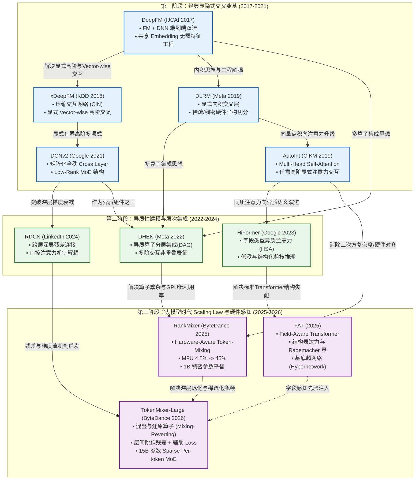

---

### 1.3 十一大核心模型横向对比全景表

| 模型 | 发表年份/机构 | 核心交互算子 | 交互层级特征 | 计算复杂度 (Token/Field 维) | 硬件友好度 (MFU) | 核心解决问题 / 创新突破 |
| :--- | :--- | :--- | :--- | :--- | :--- | :--- |
| **DeepFM** | 2017 (华为/中科院) | FM 二阶内积化简 + MLP | 显式 2 阶 (Vector) + 隐式高阶 (Bit) | $O(F k) + \text{MLP}$ | 中 | 消除 Wide&Deep 人工特征工程；FM 与 Deep 端到端共享 Embedding。 |
| **xDeepFM**| 2018 (中科大/微软) | CIN (压缩交互网络) + MLP | 显式有界高阶 (Vector) + 隐式 (Bit) | $O(\sum_{k} H_k H_{k-1} H_0 D)$ | 低 (张量外积与 1D 卷积开销极大) | 首次形式化区分 Bit-wise 与 Vector-wise，实现显式向量级任意高阶交叉。 |
| **DLRM** | 2019 (Meta) | 向量两两点积 (Dot-Product) | 显式 2 阶 (Vector) + 隐式高阶 (Top MLP) | $O(F^2 d)$ | 中（受限于 Embedding 通信瓶颈） | 规范稀疏与稠密特征解耦并行；点积层提供显式物理交叉先验。 |
| **AutoInt** | 2019 (CIKM/北大) | Multi-Head Self-Attention + 残差 | 显式任意阶（多层级联扩展，Vector） | $O(L \cdot F^2 d)$ | 低（$F^2$ 自注意力与大量 GEMV，GPU 利用率差） | 抛弃手工特征组合，利用注意力机制自适应学习高阶特征交互权重。 |
| **DCNv2** | 2021 (Google) | 矩阵化交叉 $x_0 \odot (W x_l + b)$ | 显式有界高阶 ($L$ 层代表 $L+1$ 阶，Bit) | $O(L \cdot F d \cdot r)$ (低秩分解) | 中 | 解决 DCN 秩为 1 的表达能力瓶颈，提供全秩矩阵及 Low-Rank MoE 结构。 |
| **RDCN** | 2024 (LinkedIn) | 残差化 DCN + 门控注意力 | 显式有界多阶交互 + 稠密残差公路 | $O(L \cdot F d \cdot r)$ | 中高 | 解决深层 DCN 梯度衰减与信息退化，在百层/深层架构中保持特征有效性。 |
| **DHEN** | 2022 (Meta) | 多算子层次化集成 (DAG) | 混合阶（显式点积/Cross + 隐式 MLP/Attention） | 视子算子配置而定，计算量较大 | 较低（多算子异构造成核函数调度碎片化） | 论证单一算子归纳偏置局限，用异质多算子层叠捕获非重叠交叉信息。 |
| **HiFormer** | 2023 (Google) | 异质自注意力 (HSA) + 低秩变换 | 显式任意阶软交互 (字段感知) | $O(L \cdot F^2 r)$ ($r \ll d$) | 中（经结构化剪枝与低秩优化后） | 突破传统 Transformer 同质性假设，显式建模跨字段类型异质交互偏置。 |
| **RankMixer** | 2025 (ByteDance) | Multi-Head Token-Mixing + Per-Token FFN | 线性跨字段交互 + 维度通道混合 | $O(L \cdot F^2 d)$ 纯线性高并行 GEMM | **极高 (MFU 从 4.5% $\to$ 45%)** | 工业级硬件感知设计，彻底淘汰低吞吐碎算子，实现 1B 参数零额外延迟上线。 |
| **FAT** | 2025 (ArXiv) | Field-Aware Transformer + 基底超网络 | 字段级异质全交叉 (结构对齐) | $O(L \cdot (K d^2 + F d^2))$ | 高（GEMM 密集运算） | 揭示标准 Transformer 在 CTR 上的“结构失配”，用超网络解耦字段参数与模型容量。 |
| **TokenMixer** | 2026 (ByteDance) | Mixing-and-Reverting + Sparse Per-token MoE | 深度多层非线性拓扑混合 | $O(L \cdot F \cdot E_{act} \cdot d_{ffn})$ | **极高 (专为 GPU/TPU Tensor Core 深度定制)** | 解决深层梯度消失与残差错位，在业内首次稳定扩展至 7B～15B 稠密参数规模。 |

---

## 二、 特征交叉的核心挑战与问题分类

深入理解上述论文的发展轨迹，必须首先抽象出工业界在构建排序模型时面临的底层共性矛盾。特征交叉的发展史，实际上是学术界与工业界围绕以下四对矛盾不断寻求帕累托最优（Pareto Optimality）的演变过程：

### 2.1 显式特征交叉 vs 隐式深度表征（Bit-wise vs. Vector-wise）

- **核心矛盾**：
  根据万能逼近定理，多层前馈神经网络（MLP）理论上能拟合任意非线性映射。但在实际高维稀疏样本空间中，梯度下降优化器极难通过普通的加权求和与非线性激活函数（ReLU/GELU）学习到高次乘积形式的交互项（如特征组合 $x_i x_j$ 或 $x_i x_j x_k$）。
- **学术界证明**：
  Rendle 等人在 2020 年的经典工作 *Neural Collaborative Filtering vs. Matrix Factorization Revisited* 以及 DCNv2 的理论分析中均指出：纯 DNN 拟合二阶点积或高阶点积需要极其庞大的参数量，且泛化性能极度不稳定。
- **Bit-wise vs. Vector-wise 交互粒度区分**：
  - **Bit-wise 交互（元素/位级）**：交互发生在 Embedding 向量内部的具体元素之间（如 DNN、DCN）。即便属于同一字段的向量，各维度也被拆散与其它维线性组合，破坏了字段向量作为一个整体的语义概念；
  - **Vector-wise 交互（向量级）**：交互以完整的 Embedding 向量为基本单位进行内积或哈达玛积（如 FM、xDeepFM 的 CIN、AutoInt、HiFormer）。这保持了字段原生态的语义边界。
- **演进路线**：
  - **显式算子**（Explicit）：将交叉多项式形式固化在算子中（如 DeepFM 的 FM 项、DLRM 的点积、xDeepFM 的 CIN、DCNv2 的矩阵交叉）。
  - **双流并联范式**：显式交叉流（负责记忆高频组合）与隐式深度流（负责低频泛化），二者联合学习。

### 2.2 特征同质性假定 vs 异质性语义先验

- **核心矛盾**：
  在 NLP 领域，输入句子被切分成统一词表下的 Token 序列，所有 Token 属于同质语义空间；而在推荐排序中，输入特征天然由不同**字段（Field）**组成：
  $$\text{Input} = [\text{User ID}, \text{Age}, \text{Historical Clicks}, \text{Item ID}, \text{Category}, \text{Context Time}]$$
  不同字段之间具有极强的**语义异质性（Semantic Heterogeneity）**：
  1. “User ID $\times$ Item ID”代表强烈的个性化偏好匹配；
  2. “Item ID $\times$ Category”代表物品内在属性一致性校验；
  3. “Device OS $\times$ Network Type”可能仅是环境统计弱相关。
- **演进路线**：
  - 早期模型（如 AutoInt、Vanilla Transformer）将所有 Field Embedding 平等对待，共享相同的投影矩阵 $W_Q, W_K$，强行假设特征交互在统计上是同质的。
  - 中后期模型（DHEN、HiFormer、FAT）提出**异质性显式建模**：
    - DHEN 采用异质多算子分别负责不同类型交互；
    - HiFormer 在注意力矩阵中引入跨 Field 类型的偏置项 $B_{\text{type}(i), \text{type}(j)}$；
    - FAT 彻底将变换参数字段化（Field-Centric），并通过超网络避免参数量因字段数激增而爆炸。

### 2.3 传统算子低 MFU 瓶颈 vs 硬件感知（Hardware-Aware）计算

- **核心矛盾**：
  从 CPU 集群向大规模 GPU 训推集群迁移的过程中，工业界遭遇了严重的算力浪费。很多精心设计的复杂交叉算子（如高维多项式交叉、图神经网络 FiGNN、树结构特征交叉）其理论计算量 FLOPs 并不高，但实际执行耗时极长，**模型浮点运算利用率（MFU, Model FLOPs Utilization）低至 3%～5%**。
- **根本原因**：
  1. **Memory Bound（内存带宽瓶颈）**：大量逐元素乘法（Element-wise ops）、零碎的 Gather/Scatter 操作、小维度向量点积造成 GPU 流处理器（SM）长期处于等待内存搬运的状态。
  2. **缺少 GEMM 密集算子**：现代 GPU（如 A100/H100/H800）强大的算力来自 Tensor Core 矩阵乘法（GEMM）。如果算法不能组织成大矩阵乘法形式，算力优势完全无法发挥。
- **演进路线**：
  - RankMixer 与 TokenMixer 吹响了“硬件感知模型架构（Hardware-Aligned Architecture）”的号角，果断舍弃零散的内积、手工 Cross 算子，采用高度并行的 Token-Mixing 与 Per-Token MLP，将 MFU 提高至 45% 以上，使得 1B 到 15B 参数模型在严苛延时下具备工程落地可能。

### 2.4 深度扩展（Deep Scaling）与梯度退化问题

- **核心矛盾**：
  在 CV 和 NLP 领域，增加网络层数（从 ResNet-18 到 ResNet-152，从 GPT-2 到 GPT-4）均带来了确定性的性能红利。但在排序模型中，简单的堆叠层数往往迅速导致过拟合或梯度消失。
- **根本原因**：
  推荐系统的表格特征缺乏局部空间相关性或严格的时序因果链，层数增加会导致中间表征信息迅速平滑（Over-smoothing）或者破坏原始稀疏 Embedding 中的专有高频信号。
- **演进路线**：
  - DCNv2 超过 4 层后收益急剧放缓；
  - RDCN 引入跨层 Dense Residual 跳连；
  - TokenMixer-Large 提出混合还原机制（Mixing & Reverting）与辅助重构损失，才使得特征交互网络能够在 10 层以上稳定收敛并获得持续的 Scaling 增益。

---

## 三、 十一大核心模型逐一深度拆解

```
═══════════════════════════════════════════════════════════════════════════════════════
                           十一大核心推荐排序模型演进树
═══════════════════════════════════════════════════════════════════════════════════════
 2017        2018         2019            2021            2022       2023   2024   2025   2026
 ────        ────         ────            ────            ────       ────   ────   ────   ────
 DeepFM ───► xDeepFM
   │
   ├────────────────────► DLRM ──────────┐
   │                                     │
   └────────────────────► AutoInt ───────┼────────────────────────► HiFormer ────────► FAT
                                         │                                              ▲
                          DCNv2 ─────────┴──────────────► DHEN ─────┐                   │
                            └───────────────────────────────────────┴──► RDCN           │
                                                                           │            │
                                                                           ▼            │
                                                                      RankMixer ────────┴─────► TokenMixer
                                                                     (Hardware-Aware)          (Large 15B)
═══════════════════════════════════════════════════════════════════════════════════════
```

---

### 3.1 DeepFM：端到端双流特征交叉与共享 Embedding 的奠基者

#### 背景与痛点分析
2017 年，华为诺亚方舟实验室与中科院在 IJCAI 上发表了经典之作 **DeepFM**。
在此之前，Google 的 Wide&Deep 框架是工业界最炙手可热的架构。然而，Wide&Deep 存在一个致命的工程痛点：**Wide 部分依赖大规模人工特征工程（Cross-Product Feature Transformations）**。工程师必须凭借业务经验，手动挑选哪些特征需要做交叉组合（例如 `AND(user_installed_app='Netflix', item_impression='Hulu')`）。这不仅带来了高昂的人力与试错成本，而且无法发现训练集之外未见过的新型特征组合。

#### 核心网络结构与推导

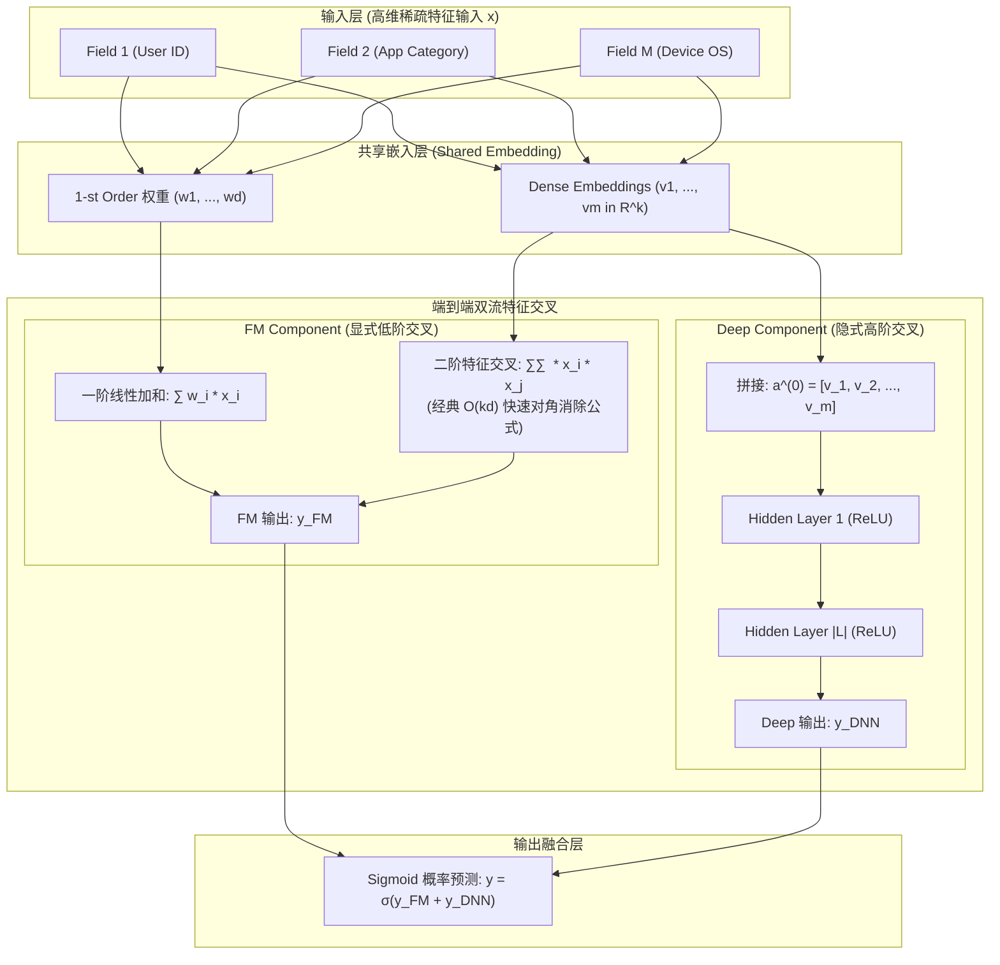

1. **共享 Embedding 机制（Shared Embeddings）**：
   DeepFM 的核心突破在于：**FM 组件与 Deep 组件完全共享底层的特征嵌入向量（Embedding Vectors）**。
   对于每个稀疏 Field $i$，其离散值映射为连续低维稠密向量 $v_i \in \mathbb{R}^k$。该向量同时服务于两条路径：
   - 在 FM 组件中充当潜在因子（Latent Vector）计算特征内积；
   - 在 Deep 组件中作为多层感知机的输入输入前馈网络。
   **双重梯度回传（Dual Gradient Propagation）**：梯度同时从低阶显式路径和高阶隐式路径反向传播，使得 Embedding 能够兼顾记忆性（Memorization）与泛化性（Generalization），无需任何特征预训练。

2. **FM 组件数学推导与计算优化**：
   FM 部分包含一阶线性项与二阶交叉项：
   $$y_{\text{FM}} = \langle w, x \rangle + \sum_{i=1}^d \sum_{j=i+1}^d \langle v_i, v_j \rangle x_i x_j$$
   直接计算两两特征向量内积的复杂度为 $O(k \cdot d^2)$。Rendle 提出的经典化简技巧将两两点积和转化为多项式差值，计算复杂度直接降为 $O(k \cdot d)$：
   $$\begin{aligned}
   \sum_{i=1}^d \sum_{j=i+1}^d \langle v_i, v_j \rangle x_i x_j 
   &= \frac{1}{2} \sum_{i=1}^d \sum_{j=1}^d \sum_{f=1}^k v_{i,f} v_{j,f} x_i x_j - \frac{1}{2} \sum_{i=1}^d \sum_{f=1}^k v_{i,f} v_{i,f} x_i x_i \\
   &= \frac{1}{2} \sum_{f=1}^k \left[ \left( \sum_{i=1}^d v_{i,f} x_i \right) \left( \sum_{j=1}^d v_{j,f} x_j \right) - \sum_{i=1}^d v_{i,f}^2 x_i^2 \right] \\
   &= \frac{1}{2} \sum_{f=1}^k \left[ \left( \sum_{i=1}^d v_{i,f} x_i \right)^2 - \sum_{i=1}^d v_{i,f}^2 x_i^2 \right]
   \end{aligned}$$

3. **Deep 组件与最终预测**：
   将所有活跃字段的嵌入向量拼接作为网络底层输入：
   $$a^{(0)} = [v_1, v_2, \dots, v_m] \in \mathbb{R}^{m \cdot k}$$
   经过多层非线性全连接前馈传播：
   $$a^{(l+1)} = \text{ReLU}\left( W^{(l)} a^{(l)} + b^{(l)} \right)$$
   $$y_{\text{DNN}} = W^{(|L|+1)} a^{(|L|)} + b^{(|L|+1)}$$
   最终点击率预测通过 Sigmoid 激活函数联合输出：
   $$\hat{y} = \sigma\left( y_{\text{FM}} + y_{\text{DNN}} \right)$$

#### 核心贡献与工业反思
- **里程碑意义**：DeepFM 彻底终结了手工组合特征的时代，成为了近十年工业界落地范围最广、最经典的“黄金基线（Golden Baseline）”之一。
- **历史局限性**：
  1. FM 组件仅能处理严格的**二阶**交叉；
  2. 超过二阶的高阶特征交互全部丢给了 Deep 组件（MLP），而正如前文所述，MLP 进行的是隐式、Bit-wise 交叉，无法精准控制高阶特征交互的形式。

---

### 3.2 xDeepFM：Vector-wise 显式高阶压缩交互网络 (CIN)

#### 背景与理论洞察：Bit-wise vs. Vector-wise
2018 年，中国科学技术大学与微软亚洲研究院在 KDD 上发表了 **xDeepFM (eXtreme Deep Factorization Machine)**。
作者提出了推荐系统特征交叉领域最深刻的理论分野之一：**位级（Bit-wise）交叉与向量级（Vector-wise）交叉的区别**：
- **Bit-wise 隐式交互**：在传统 DNN 和早期的 DCN 中，特征 Embedding 在输入隐藏层前往往被展平（Flatten）。由于矩阵乘法的加权求和机制，来自同一个 Field 内部的不同分量（bits）与其它 Field 内部的不同分量发生混合。这种交互破坏了“一个 Field 作为一个整体语义向量”的物理先验；
- **Vector-wise 显式交互**：因子分解机（FM）的核心优势在于特征交互是向量级别的（即通过内积 $\langle v_i, v_j \rangle$ 交互，输出一个代表整体相关性的标量）。
针对以往深度模型（DeepFM、DCN 等）无法以 **Vector-wise** 形式显式捕获**任意有界高阶**交互的缺陷，xDeepFM 提出了革命性的 **CIN (Compressed Interaction Network，压缩交互网络)**。

#### 核心网络结构：CIN 的数学推导与架构图

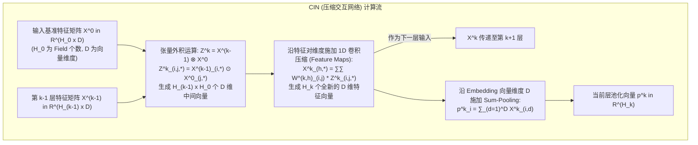

CIN 的计算过程酷似卷积神经网络（CNN），但专门作用于特征字段矩阵：
设第 $k$ 层的特征矩阵为 $X^k \in \mathbb{R}^{H_k \times D}$，其中 $H_k$ 表示该层拥有的特征向量个数（第 0 层 $H_0 = m$ 为原始字段数），$D$ 为 Embedding 维度。

1. **张量外积与特征逐元素乘法（Hadamard Product）**：
   在第 $k$ 层，CIN 将当前层状态 $X^{k-1}$ 与最原始的输入状态 $X^0$ 进行跨字段外积交互。中间状态张量 $Z^k \in \mathbb{R}^{H_{k-1} \times H_0 \times D}$ 的每个分量计算如下：
   $$Z_{i,j, \cdot}^k = X_{i, \cdot}^{k-1} \odot X_{j, \cdot}^0, \quad 1 \le i \le H_{k-1}, \; 1 \le j \le H_0$$
   这里 $\odot$ 代表向量维度的逐元素乘法。这一步显式构成了第 $k$ 阶特征组合，且严格保持了向量级别（Vector-wise）的对齐。

2. **特征图卷积压缩（Feature Maps Compression）**：
   为控制参数量并提取关键交互模式，CIN 引入 $H_k$ 个卷积核矩阵 $W^{k,h} \in \mathbb{R}^{H_{k-1} \times H_0}$。每个卷积核将高维张量 $Z^k$ 在特征对维度（$H_{k-1} \times H_0$）进行加权压缩求和，生成第 $k$ 层的第 $h$ 个特征向量：
   $$X_{h, \cdot}^k = \sum_{i=1}^{H_{k-1}} \sum_{j=1}^{H_0} W_{i,j}^{k,h} Z_{i,j, \cdot}^k \in \mathbb{R}^D, \quad 1 \le h \le H_k$$
   此时，$X^k \in \mathbb{R}^{H_k \times D}$ 构成了第 $k$ 层输出。

3. **多尺度求和池化（Sum-Pooling）与预测**：
   与传统的仅用最后一层输出不同，CIN 效仿多尺度特征融合，在每一层 $k \in \{1, 2, \dots, K\}$ 均对特征向量进行沿维度 $D$ 的求和池化：
   $$p_i^k = \sum_{d=1}^D X_{i,d}^k, \quad 1 \le i \le H_k$$
   将所有层级的池化向量级联拼接成多阶汇总向量：
   $$p^+ = [p^1, p^2, \dots, p^K] \in \mathbb{R}^{\sum_{k=1}^K H_k}$$
   xDeepFM 最终将 **Linear 线性项、Plain DNN 隐式项以及 CIN 显式高阶向量项** 联合加权输出：
   $$\hat{y} = \sigma\left( w_{\text{linear}}^T x + w_{\text{dnn}}^T a^{(|L|)} + w_{\text{cin}}^T p^+ \right)$$

#### 核心贡献与工业反思
- **理论高度**：xDeepFM 首次实现了：① 显式特征交叉；② 严格 Vector-wise 向量级；③ 交互阶数随网络层数线性可控增长；④ 参数不随输入序列长度无限爆炸。
- **工程落地阻碍**：
  CIN 中的张量外积与特征图 1D 卷积操作的时间与空间复杂度高达 $O(\sum_k H_k H_{k-1} H_0 D)$。当工业界特征字段数 $H_0 > 100$ 时，中间张量 $Z^k$ 的显存占用和卷积延迟极其庞大，导致 xDeepFM 在超大工业在线推荐中极难满足几毫秒的极限 SLA 要求。这也直接催生了后序研究对低秩化、矩阵化（DCNv2）以及硬件亲和性（RankMixer）的探索。

---

### 3.3 DLRM：工业级稀疏与稠密特征解耦的奠基石

#### 背景与动机
2019 年，Facebook (现 Meta) 提出了 **DLRM (Deep Learning Recommendation Model)**。当时工业界存在 DeepFM、Wide&Deep 等方案，但缺乏一个在系统硬件架构与模型结构上完全协同的工业基准。DLRM 明确了大规模推荐系统的双重属性：**处理稀疏 Categorical 特征的内存密集型任务**，与**处理稠密 Continuous 特征的算力密集型任务**。

#### 核心网络结构与推导

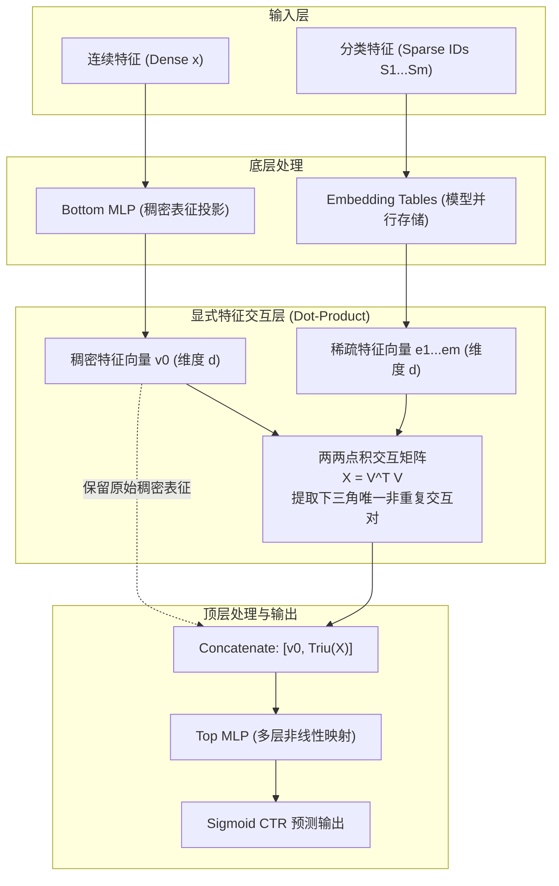

1. **底层映射（Bottom Representation）**：
   - 连续特征 $x \in \mathbb{R}^C$ 通过 Bottom MLP 映射到与稀疏嵌入相同的隐藏空间维度 $d$：
     $$v_0 = \text{MLP}_{\text{bottom}}(x) \in \mathbb{R}^d$$
   - $M$ 个稀疏类别特征查表得到 $M$ 个 $d$ 维嵌入向量：
     $$v_i = \text{EmbeddingLookUp}(S_i) \in \mathbb{R}^d, \quad i \in \{1, 2, \dots, M\}$$

2. **显式点积交互层（Dot-Product Interaction）**：
   将所有表征拼接成矩阵 $V = [v_0, v_1, v_2, \dots, v_M] \in \mathbb{R}^{d \times (M+1)}$。
   两两之间计算点积生成对称相关性矩阵 $A \in \mathbb{R}^{(M+1) \times (M+1)}$：
   $$A = V^T V, \quad A_{i,j} = \langle v_i, v_j \rangle = v_i^T v_j$$
   由于 $A_{i,i}$ 为自身内积且 $A_{i,j} = A_{j,i}$，DLRM 仅提取严格上三角（或下三角）元素作为显式二阶交叉特征：
   $$f_{\text{inter}} = \text{vech\_lower}(A) = [v_i^T v_j]_{0 \le j < i \le M} \in \mathbb{R}^{\frac{M(M+1)}{2}}$$

3. **顶层预测（Top MLP）**：
   将原始稠密特征向量 $v_0$ 与所有二阶交叉项拼接，输入 Top MLP 进行非线性抽象与概率回归：
   $$\hat{y} = \sigma\left( \text{MLP}_{\text{top}}\left( [v_0^T, f_{\text{inter}}^T]^T \right) \right)$$

#### 核心贡献与系统创新
- **混合并行系统架构（Hybrid Parallelism）**：Embedding 占用数百 GB 显存，采用**模型并行（Model Parallelism）**分布在多张 GPU 卡上；MLP 与交互层计算密集，采用**数据并行（Data Parallelism）**。两者之间通过高效的 All-to-All 集合通信原语连接。
- **纯粹简洁的物理先验**：放弃复杂的无序连接，用纯粹的点积矩阵提取二阶相关性，成为工业推荐最坚实的 baseline。

---

### 3.4 AutoInt：基于自注意力机制的任意阶显式交叉

#### 背景与动机
AutoInt (Automatic Feature Interaction Learning via Self-Attentive Neural Networks, 2019) 针对已有模型（FM 局限在 2 阶、DCN 组合受限、DeepFM 依赖隐式 DNN）的短板，首次将 Transformer 的 Multi-Head Self-Attention (MHSA) 机制引入表格特征交互，旨在**自动映射与学习任意阶高阶特征交叉**，且无需任何手工规则。

#### 核心网络结构与数学推导
设输入包含 $M$ 个特征字段（Field），每个字段映射为固定长度 $d$ 的嵌入向量 $e_i \in \mathbb{R}^d$。

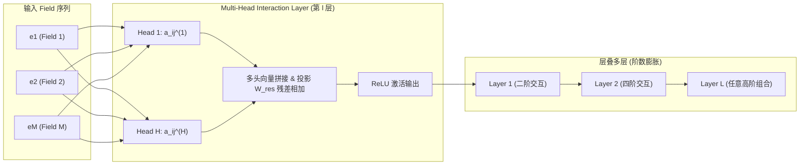

1. **交互亲和度（Attention Weights）**：
   在第 $m$ 个注意力头中，字段 $i$ 与字段 $j$ 的显式交互强度由下式计算：
   $$\alpha_{i,j}^{(m)} = \frac{\exp\left( \psi^{(m)}(e_i, e_j) \right)}{\sum_{k=1}^M \exp\left( \psi^{(m)}(e_i, e_k) \right)}$$
   其中非对称交互打分函数定义为：
   $$\psi^{(m)}(e_i, e_j) = \frac{\langle W_Q^{(m)} e_i, W_K^{(m)} e_j \rangle}{\sqrt{d'}}$$
   其中 $W_Q^{(m)}, W_K^{(m)} \in \mathbb{R}^{d' \times d}$ 分别为 Query 和 Key 投影矩阵，$d'$ 为单头维度。

2. **特征聚合与多头融合**：
   字段 $i$ 汇聚所有其他字段在其投影子空间下的信息：
   $$z_i^{(m)} = \sum_{j=1}^M \alpha_{i,j}^{(m)} \left( W_V^{(m)} e_j \right)$$
   将 $H$ 个头的表征进行拼接并施加残差连接以保留原始阶数信息：
   $$z_i = \text{Concat}\left( z_i^{(1)}, z_i^{(2)}, \dots, z_i^{(H)} \right) \in \mathbb{R}^{H d'}$$
   $$e_i^{(l+1)} = \text{ReLU}\left( z_i + W_{\text{res}} e_i^{(l)} \right)$$

3. **高阶组合原理**：
   - 1 层注意力交互捕获 2 阶特征组合；
   - 2 层注意力交互可将已聚合的 2 阶组合再次聚合，从而形成 4 阶及更高阶特征组合；
   - 注意力系数 $\alpha_{i,j}$ 直观揭示了哪些字段组合对最终预估贡献最大，具备极强的**模型可解释性**。

#### 局限性与工业反思
虽然 AutoInt 在学术基准上大幅领先，但在工业界落地极其艰难：
- 计算复杂度高达 $O(L \cdot M^2 d)$，当工业特征字段 $M > 200$ 时，自注意力矩阵计算与 Softmax 成为线上推理延时的重大杀手；
- 假定所有字段的 Query/Key 映射均在同一个全局投影参数矩阵下完成，忽略了推荐特征极其强烈的字段异质性。

---

### 3.5 DCNv2：突破低秩瓶颈的张量化显式特征交叉网络

#### 背景与痛点分析
Google 提出的 DCN (Deep & Cross Network, 2017) 曾是工业界使用最广的显式交叉模型之一。但 Google 团队在 2021 年发表的 **DCNv2** 中坦诚指出：**DCNv1 的 Cross Network 存在严重的表达能力瓶颈（Low-Rank Bottleneck）**。
在 DCNv1 中，第 $l+1$ 层的交叉公式为：
$$x_{l+1} = x_0 x_l^T w_l + b_l + x_l$$
注意项 $x_0 x_l^T w_l = x_0 (x_l^T w_l)$。其中 $x_l^T w_l$ 是一个**标量（Scalar）**！
这意味着输出向量 $x_{l+1} - x_l$ 永远只是输入向量 $x_0$ 的标量缩放倍数，其张量积矩阵的秩（Rank）严格等于 1。这极大地扼杀了模型拟合高维复杂特征非线性交互的能力。

#### DCNv2 核心数学推导与架构

DCNv2 将交叉项中的权重向量直接升级为**全秩权重矩阵（Full-Rank Matrix）**，并结合逐元素哈达玛积（Hadamard product）：

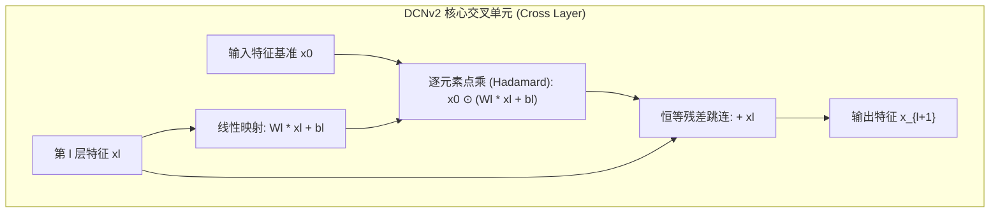

公式表达为：
$$x_{l+1} = x_0 \odot \left( W_l x_l + b_l \right) + x_l$$
其中：
- $x_0, x_l \in \mathbb{R}^D$ 是输入与当前层表征（$D = M \times d$）；
- $W_l \in \mathbb{R}^{D \times D}$ 为完全可学习的高维权重参数矩阵；
- $\odot$ 表示逐元素乘法（Hadamard Product）。

此时，$W_l x_l$ 输出为一个高维多自由度向量，彻底粉碎了 DCNv1 标量坍缩的桎梏，每一维特征均可与 $x_0$ 发生独立加权的二阶交叉。

#### 工程落地挑战与 Low-Rank MoE 创新
由于特征总维度 $D$ 往往高达数千，$W_l \in \mathbb{R}^{D \times D}$ 的参数量和计算复杂度为 $O(D^2)$，在线推理极其昂贵。为此，DCNv2 提出了两项绝妙工程改进：

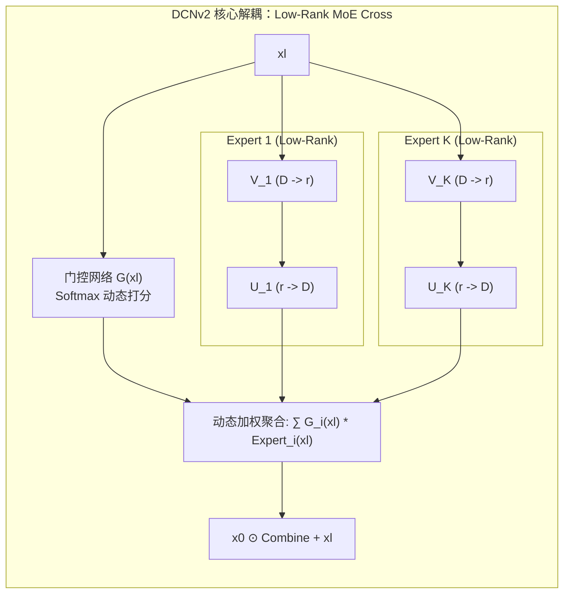

1. **低秩分解（Low-Rank Factorization）**：
   利用矩阵低秩分解将 $W_l$ 拆解为两个细长矩阵的乘积：
   $$W_l = U_l V_l^T, \quad U_l, V_l \in \mathbb{R}^{D \times r}, \quad r \ll D$$
   计算过程转化为：
   $$W_l x_l = U_l \left( V_l^T x_l \right)$$
   将计算复杂度从 $O(D^2)$ 瞬间降为 $O(2 D r)$。

2. **混合专家低秩交叉（Mixture of Low-Rank Cross Experts）**：
   为了用低计算量弥补低秩带来的容量削弱，DCNv2 结合 MoE 思想，并行部署 $K$ 个低秩专家，并通过门控网络动态选择：
   $$x_{l+1} = \sum_{i=1}^K G_i(x_l) \left( x_0 \odot \left( U_{l,i} \left( V_{l,i}^T x_l \right) + b_l \right) \right) + x_l$$
   其中 $G(x_l) = \text{Softmax}(W_g x_l) \in \mathbb{R}^{K}$。

---

### 3.6 RDCN：深层交叉网络退化破解与残差注意力强化

#### 背景与痛点分析
在 LinkedIn 大规模排序架构 **LiRank**（KDD 2024）的生产落地实践中，算法团队发现：尽管 DCNv2 在 2～4 层时表现亮眼，但当工程师尝试像深度视觉或语言模型那样，将 Cross 层堆叠得更深（例如 8～16 层甚至更高）以挖掘更高阶极端交互时，模型出现了**严重的收益饱和甚至性能大幅衰减**。
核心原因在于：
1. 每一层 Cross Layer 均强制注入初始输入 $x_0$，高层特征的梯度在回传至浅层时面临严重的数值弥散与路径阻断；
2. 固定的跳跃残差无法根据样本输入自适应控制深层特征与原始特征的信息吞吐配比。

#### RDCN (Residual DCN) 架构机制与数学表达
针对上述退化问题，LinkedIn 提出了 **RDCN (Residual DCN)**，在 DCNv2 的骨干之上进行了三重关键拓扑升级：

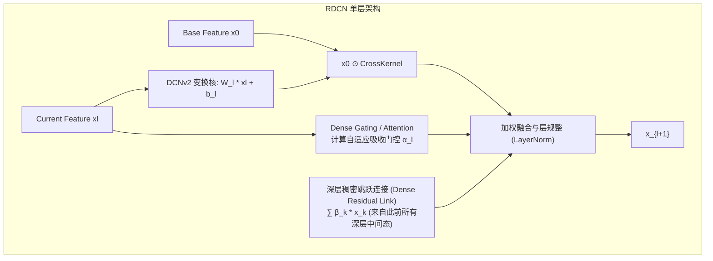

1. **门控稠密注意力机制（Dense Gating Mechanism）**：
   摒弃恒定直接相乘，引入自注意力门控向量对交叉信号进行通道级重要性重新校准：
   $$g_l = \sigma\left( W_{\text{gate}}^{(l)} x_l + b_{\text{gate}}^{(l)} \right)$$
   $$\tilde{x}_{l} = g_l \odot \left( x_0 \odot (W_l x_l + b_l) \right)$$

2. **跨层全连接残差跳连（Multi-Scale Residual Highway）**：
   不同于普通 DCNv2 仅有 $x_{l+1} = \text{Cross}(x_l) + x_l$，RDCN 引入受 DenseNet 启发的深层残差公路，将所有先验历史层的信息作为跳连候选集：
   $$x_{l+1} = \tilde{x}_l + \sum_{k=0}^l \gamma_{k,l} x_k$$
   其中 $\gamma_{k,l}$ 为可学习或动态计算的层间注意力权重。这使得高阶交叉梯度可以无损、短程直达底层 Embedding，彻底打破深层 Cross 网络的退化诅咒。

---

### 3.7 DHEN：异质交叉多算子层次化集成的先驱

#### 背景与动机
2022 年，Meta 在其广告 CTR 预估系统研发中提出了 **DHEN (Deep and Hierarchical Ensemble Network)**。Meta 研究人员敏锐地发现：工业界涌现了大量特征交叉结构（如 DLRM 的 Dot-Product、DCN 的多项式外积、AutoInt 的自注意力、FM 的二阶因子分解、Wide 的线性偏置）。
但在大规模真实数据集上的横向评测显示：**即使声称能捕捉相同阶数交互的两个模型，它们在不同数据集上的优劣表现也截然相反，没有任何一个单一架构能在所有场景下保持统治力**。
这表明：**不同交互算子具备完全非重叠的归纳偏置（Non-overlapping Inductive Biases）与信息捕获盲区**。

#### 核心网络结构：有向无环图（DAG）分层集成
DHEN 不再试图设计某种“万能单一算子”，而是提出了一种结构宏大的层次化集成网络：

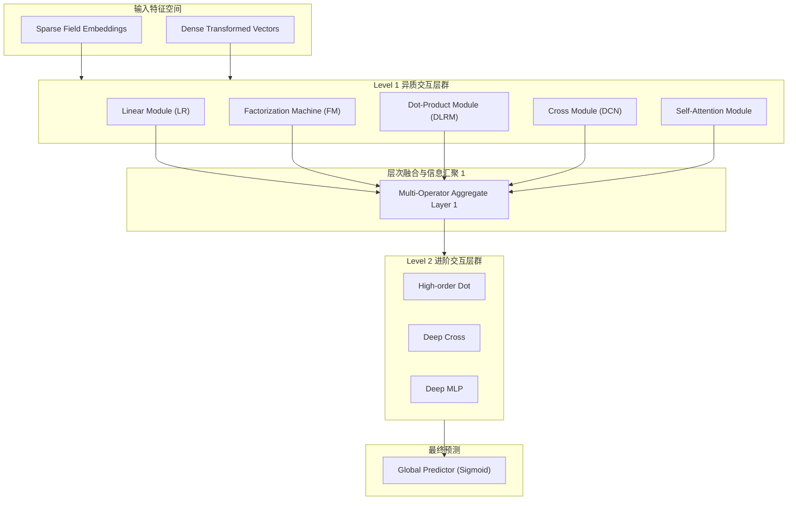

1. **异质模块库（Heterogeneous Module Zoo）**：
   DHEN 在每一层部署一个异质模块集合 $\mathcal{M} = \{M_1, M_2, \dots, M_K\}$，包括：
   - **线性流（Linear/LR）**：捕捉原始特征独立显著性；
   - **因子分解流（FM）**：无参数计算特征对内积；
   - **点积流（Dot-Product）**：全通道两两向量点乘；
   - **张量交叉流（Cross Network）**：受控阶数有界多项式映射；
   - **自注意力流（Self-Attention）**：自适应软寻址交互；
   - **非线性深层前馈流（MLP）**：全连接隐式非线性空间投影。

2. **深层层次化堆叠（Hierarchical Stacking）**：
   设第 $l$ 层有若干模块。第 $l$ 层的输出不仅向同层下游流动，还将与前序所有层的原始特征共同作为第 $l+1$ 层各个模块的组合输入：
   $$H^{(l+1)} = \text{Concat}\left( \left\{ M_k^{(l+1)}\left( [H^{(0)}, H^{(1)}, \dots, H^{(l)}] \right) \right\}_{k=1}^K \right)$$
   通过将不同算子在时间与空间维度组织为类似 DAG（有向无环图）的分层流动，低阶交互在底层形成基石，高阶混合交互在顶层自然涌现。

#### 系统软硬件协同设计（Co-Design）
DHEN 深度极大，结构异构，直接在 PyTorch 中常规训练会导致极其低效的串行等待。Meta 为此专门研发了**层次流水线并行（Hierarchical Pipelined Training System）**：
- 显式将计算无依赖的子算子（如同层的 FM 与 Dot-Product）切分到不同 CUDA Stream 异步并发发射；
- 对长反向传播链路应用定制的激活值重计算（Activation Checkpointing）与权重分级流水线，使 DHEN 在取得 0.27% Normalized Entropy (NE) 巨大商业提升的同时，训练吞吐量反而提升了 1.2 倍。

---

### 3.8 HiFormer：跨字段异质性自注意力与低秩压缩

#### 背景与动机
2023 年，Google 将目光投向了工业推荐与移动应用商店排名（Google Play），发表了 **HiFormer (Heterogeneous Interaction Transformer)**。
Google 团队直击 Transformer 在工业推荐落地的第一大痛点：**标准自注意力将所有字段 token 一视同仁，完全抹杀了字段异质性（Heterogeneity）**。
例如在 Google Play 场景下：
- `(User_Installed_Apps, Target_App)` 的注意力计算关注的是“相关性与同类推导”；
- `(Target_App, App_Category)` 的注意力计算是“属性归属判定”；
- `(User_Network_Type, App_Size)` 的注意力计算关注的是“下载环境摩擦阻力”。
标准 Transformer 用一组统一的 $W_Q, W_K$ 强行映射所有关系，导致模型表达能力大打折扣。

#### 异质自注意力机制（Heterogeneous Self-Attention, HSA）
HiFormer 提出了颠覆性的**异质自注意力层（HSA Layer）**：

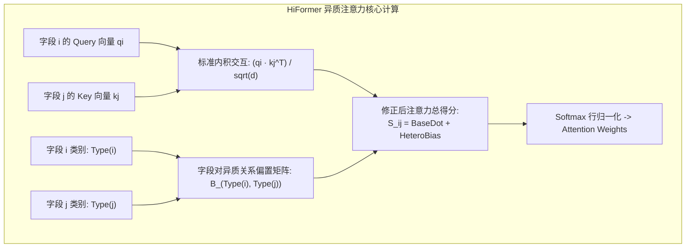

1. **类型感知注意力标量计算**：
   设共有 $M$ 个特征字段，字段 $i$ 具备属性类别 $\tau_i \in \{1, 2, \dots, C\}$（如用户域、物品域、上下文域）。
   两个字段 $i$ 与 $j$ 的注意力打分公式被重构为：
   $$\text{Score}(i, j) = \frac{\langle W_Q e_i, W_K e_j \rangle}{\sqrt{d}} + \mathbf{B}_{\tau_i, \tau_j}$$
   其中 $\mathbf{B} \in \mathbb{R}^{C \times C}$ 是一个可学习的**字段类型关系偏置矩阵（Type-Pair Bias Matrix）**。它直接为不同语义域之间的交互注入了强烈的归纳先验（例如强行加大 User 与 Item 的交互基线偏置）。

2. **字段感知投影拓展（Field-Aware Projections）**：
   在更强版本中，投影矩阵本身与字段类型绑定：
   $$\text{Score}(i, j) = \frac{e_i^T \left( W_Q^{(\tau_i) T} W_K^{(\tau_j)} \right) e_j}{\sqrt{d}} + \mathbf{B}_{\tau_i, \tau_j}$$
   彻底允许不同语义实体在独立的流形子空间中度量相似度。

#### 工业极速推理优化：低秩与结构化剪枝
针对 Google Play 对 P99 延迟的极致要求，HiFormer 提出了两套工程降耗组合拳：
- **Projection 低秩分解**：将 $W_Q, W_K \in \mathbb{R}^{d \times d}$ 压缩为高细比矩阵乘积 $U V^T$（秩 $r \ll d$）；
- **注意力稀疏剪枝（Attention Head Pruning）**：通过可微掩码（Differentiable Masking）评估不同头在实际验证集上的重要性，在上线部署前剪除多达 50% 贡献微弱的交互头，最终实现在超大规模 Google Play 线上模型中提升关键指标（+2.66% 转化），且延迟完全符合生产 SLA。

---

### 3.9 RankMixer：面向现代 GPU 架构的十亿级硬件亲和排序模型

#### 工业革命性转折：硬件感知设计（Hardware-Aware Design）
2025 年，字节跳动（ByteDance）在推荐架构领域投下了一颗重磅炸弹——发表 **RankMixer: Scaling Up Ranking Models in Industrial Recommenders**。
字节团队首次系统性揭开了工业界排序模型 Scaling 失败的遮羞布：
在过去几年中，业界在 CPU 时代设计了无数眼花缭乱的手工交叉算子（如各种细粒度点积、局部乘加、多路碎片化浅层网络）。当整个推荐架构迁移至以 GPU 为主的现代算力基础设施时，这些模型的**模型浮点运算利用率（MFU）低得令人发指——仅有 4.5% 左右！**
这意味着 GPU 上 95% 以上的时间全在等待显存 I/O，Tensor Core 的恐怖算力被彻底闲置。盲目扩大参数量只会导致线上推理超时，ROI 极低。

RankMixer 的核心哲学是：**完全面向现代 GPU 硬件架构（如 Tensor Core 矩阵乘单元）逆向设计推荐交互模型，用高 MFU 的极简大矩阵计算平替一切零散算子！**

#### RankMixer 架构设计与推导

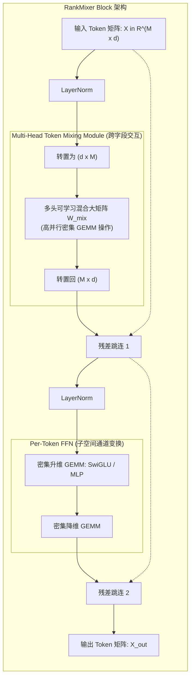

RankMixer 彻底废弃了复杂度为 $O(M^2 d)$ 的自注意力 Softmax 计算，借鉴 MLP-Mixer 思想，将其改造为**纯密集 GEMM 的多头 Token Mixing**：

1. **多头 Token 混合（Multi-Head Token-Mixing）**：
   将输入 $M$ 个字段的 Embedding 堆叠为矩阵 $X \in \mathbb{R}^{M \times d}$。在特征交叉阶段，网络沿 Token 序列维度（即 Field 维度）进行全局线性混叠：
   $$X_{\text{mix}}^{(h)} = W_{\text{mix}}^{(h)} X^{(h)}, \quad W_{\text{mix}}^{(h)} \in \mathbb{R}^{M \times M}$$
   其中 $h \in \{1, \dots, H\}$ 代表多头划分。
   - **计算特征**：$W_{\text{mix}}$ 是一个纯粹的稠密方阵，它一次性、显式地计算了所有字段之间的线性混合系数；
   - **硬件亲和**：底层执行时退化为极速的 Batched GEMM（批量矩阵乘法），无任何分支预测与数据搬移，GPU Tensor Core 瞬间被拉满。

2. **Per-Token 前馈网络（Per-Token FFN）**：
   Token 混合完成后，特征矩阵进入独立的通道前馈网络，针对每个字段各自的高维子空间进行非线性升降维抽取：
   $$\text{FFN}(X_i) = W_2 \cdot \text{GELU}\left( W_1 X_i + b_1 \right) + b_2, \quad X_i \in \mathbb{R}^d$$

3. **稀疏专家扩展（Sparse-MoE RankMixer）**：
   为将模型容量推向 10 亿（1B）参数级别，RankMixer 将 Per-Token FFN 扩展为 Sparse-MoE 架构，采用动态 Top-2 路由，并引入负载均衡 Auxiliary Loss 防止专家坍缩。

#### 工业实测里程碑
在字节跳动万亿级生产样本集群上：
- **MFU 从 4.5% 暴增 10 倍至 45%**；
- 在**完全不增加线上推理延迟**的前提下，稠密参数量扩张 70～100 倍（上线 1B 稠密参数模型）；
- 全量上线抖音推荐与商业化广告核心业务，用户活跃天数（AAD）提升 +0.3%，应用使用总时长提升 **+1.08%**。

---

### 3.10 FAT：结构表达力与超网络解耦字段参数的 Field-Aware Transformer

#### 理论突破：揭示推荐大模型的“结构失配”
2025 年底发表的重磅工作 **FAT (Field-Aware Transformer)**，直面了整个推荐学术界在将 Transformer 推向极大规模时的深层困惑：
**为什么在 NLP 中增加模型尺寸（Scaling）总是带来稳步降低的交叉熵 Loss，而在推荐 CTR 预估中，简单堆叠 Transformer 参数量往往出现断崖式的边际收益递减甚至过拟合？**

该论文从学习理论出发，证明了其中的核心症结为**结构失配（Structural Misalignment）**：
- **NLP 数据假设**：序列组合性（Sequential Compositionality），Token 在词表中遵循相同语法规则在时序上滑动；
- **CTR 表格数据本质**：异质字段的离散组合推理（Combinatorial Reasoning over Heterogeneous Fields）。
标准 Transformer 强行用一套共享权重对异质字段做因果或全双工自注意力，造成理论泛化界极差。

#### FAT 核心方法与数学推导

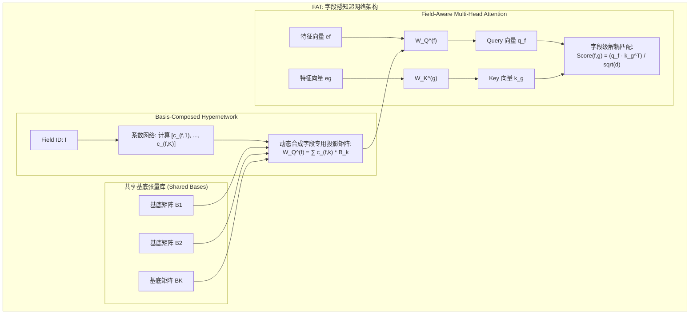

1. **字段感知参数重构（Field-Centric Parameterization）**：
   为彻底解决同质映射失配，FAT 赋予每一个 Field $f \in \{1, \dots, M\}$ 专属性的参数矩阵 $W_Q^{(f)}, W_K^{(f)}, W_V^{(f)}$：
   $$q_f = W_Q^{(f)} e_f, \quad k_g = W_K^{(g)} e_g, \quad v_g = W_V^{(g)} e_g$$
   $$\text{Attn}(f, g) = \frac{\exp\left( \frac{q_f k_g^T}{\sqrt{d}} \right)}{\sum_{u=1}^M \exp\left( \frac{q_f k_u^T}{\sqrt{d}} \right)}$$
   此举完全恢复了对表格数据异质交叉的结构对齐（Structured Expressivity）。

2. **基底超网络（Basis-Composed Hypernetwork）解耦参数爆炸**：
   如果为工业界数百个 Field 独立创建参数矩阵，参数量为 $O(M \cdot d^2)$，不仅容易过拟合，且显存无法承受。
   FAT 设计了一个优雅的**基底超网络**：在底层维护 $K$ 个全局共享的基底张量 $\mathcal{B} = \{B_1, B_2, \dots, B_K\}$（$K \ll M$），任意字段 $f$ 的专属权重矩阵由超网络生成的系数线性组合而成：
   $$W_Q^{(f)} = \sum_{k=1}^K c_{f,k} B_k, \quad c_f = \text{HyperNet}(f) \in \mathbb{R}^K$$
   - **理论意义**：基底 $B_k$ 负责捕获跨特征领域的全局元知识（Meta-Knowledge），系数 $c_{f,k}$ 负责调节该字段的语义个性化；
   - 彻底将模型容量扩展与输入字段数量 $M$ 实现了解耦。

3. **Rademacher 复杂度泛化界保证**：
   作者从统计学习理论推导了 FAT 的 Rademacher 复杂度上界，数学上严格证明了 FAT 的泛化误差边界收敛速率显著优于标准 Transformer，为排序模型的 Scaling 提供了首个严密的理论保护。
   在生产环境实测中，FAT 取得 AUC **+4.38%** 的惊人增益，并在实际生产 A/B 测试中实现 CTR **+2.33%**，RPM **+0.66%**。

---

### 3.11 TokenMixer / TokenMixer-Large：百亿稠密参数推荐大模型的极限扩展

#### 背景与深层架构瓶颈诊断
在 RankMixer 成功将工业排序模型推进到 1B 参数之后，2026 年初，字节跳动发布了续作 **TokenMixer-Large: Scaling Up Large Ranking Models in Industrial Recommenders**。
字节团队在尝试将基于 TokenMixer 的网络向更深（8～16层）、更大（4B～15B）规模继续 Scaling 时，遭遇了三大深水区瓶颈：
1. **模型架构“不纯（Impure）”与碎片遗留**：生产模型中依旧挂载着历史遗留的 DCN、LHUC 等补丁算子，阻碍了端到端高效推理；
2. **深层网络梯度耗散（Vanishing Gradients）**：TokenMixer 原生结构在超过 2～4 层后，深层特征更新严重停滞，浅层反向传播梯度微弱；
3. **MoE 稀疏化不彻底**：参数量虽然被 MoE 放大了，但在单卡内存与 All-to-All 通信上造成了严峻的显存突刺。

#### TokenMixer-Large 核心系统性进化

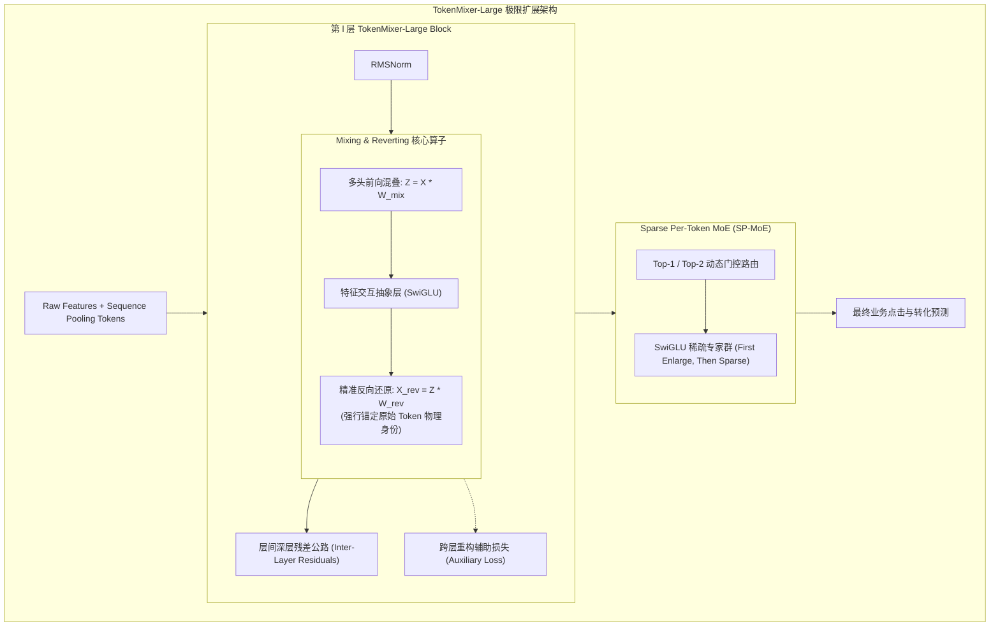

1. **混叠与还原算子（Mixing & Reverting Operation）**：
   以往的 Token 混合在连续多层之后，中间表征彻底失去了原始语义对应的物理标识。TokenMixer-Large 提出了对称的**混合-还原双射操作**：
   $$Z_l = \text{Mix}(X_l; W_{\text{mix}}^{(l)}) = X_l W_{\text{mix}}^{(l)}$$
   $$\tilde{X}_l = \text{NonLinear}(Z_l)$$
   $$X_{l+1} = \text{Revert}(\tilde{X}_l; W_{\text{rev}}^{(l)}) + X_l = \tilde{X}_l W_{\text{rev}}^{(l)} + X_l$$
   通过强行引入还原变换矩阵 $W_{\text{rev}}$，网络在跨字段充分混叠交互的同时，保证每层输出始终投影回原始各个 Field 的物理对齐基底上，消除了深层表征漂移。

2. **层间跳跃残差与辅助损失（Inter-Layer Residuals & Auxiliary Loss）**：
   - 引入长程跳跃连接跨越多个 Block 直接流通信息；
   - 提出浅层重构辅助目标（Auxiliary Self-Supervised Loss）：强制要求高层中间特征能够以较低误差线性重构浅层 Embedding，在损失函数端直接拉动底层梯度的有效回传。

3. **Sparse Per-Token MoE (SP-MoE)**：
   采取**“先扩充后稀疏（First Enlarge, Then Sparse）”**策略：将 SwiGLU 中的全连接升维网络全部解耦为细粒度专家库，结合 Per-Token 动态路由，将每个 Token 分发到最匹配的专家组合中，使得激活参数量仅占总参数量的 $\sim 25\%$。

#### 极限业务战果
TokenMixer-Large 成功在字节跳动核心业务上实现了**在线流量 70 亿参数（7B）、离线实验 150 亿参数（15B）**的推荐工业界最庞大稠密模型纪录：
- **电商业务**：订单量提升 **+1.66%**，人均预览支付 GMV 提升 **+2.98%**；
- **商业化广告**：广告有效展示收益指标（ADSS）提升 **+2.0%**；
- **直播业务**：流水大盘提升 **+1.4%**。
彻底确立了 TokenMixer 架构作为大模型时代工业排序模型演进标准的领先地位。

---

## 四、 跨维度的纵向演进对比与技术内生逻辑

### 4.1 核心范式演进：Bit-wise 隐式 vs Vector-wise 显式特征交叉

推荐排序系统中的特征交叉设计，在微观物理层面上始终存在着 **Bit-wise（位级）** 与 **Vector-wise（向量级）** 的博弈与融合：

| 维度 | Bit-wise 交叉（代表：DNN, DCN, DCNv2） | Vector-wise 交叉（代表：FM, DeepFM, xDeepFM CIN, AutoInt） |
| :--- | :--- | :--- |
| **物理单位** | 标量浮点数值（Embedding 向量中的单独元素 $v_{i,f}$） | 完整的语义向量（整个字段的 Embedding $v_i \in \mathbb{R}^d$） |
| **交互算子** | 线性加权和、张量外积全矩阵映射、MLP 全连接层 | 向量内积 $\langle v_i, v_j \rangle$、Hadamard 积 $v_i \odot v_j$、自注意力打分 |
| **优势** | 拟合自由度极高，能够捕获微观数值维度的细粒度关联；易于通过大矩阵乘加速。 | 物理语义极其明确，严格保留 Field 边界与实体属性完整性；可解释性强。 |
| **劣势** | 容易打散字段语义整体性，训练收敛更依赖海量样本，易受梯度噪声污染。 | 算子实现（如张量积、卷积）容易产生内存瓶颈，在深层不易加深。 |
| **融合趋势** | **现代架构趋势（如 FAT, RankMixer）**：在 Token Mixing 阶段进行 Vector/Token 级别的全局拓扑交互，在 Per-Token FFN 阶段进行通道内的 Bit-wise 深度非线性变换，实现两者的统一。 |

---

### 4.2 Cross Network 支线演进（DCN $\to$ DCNv2 $\to$ RDCN）

```
┌─────────────────┐       ┌─────────────────┐       ┌─────────────────┐
│     DCNv1       │  ──►  │     DCNv2       │  ──►  │      RDCN       │
│ 向量外积 (Rank 1)│       │ 全秩矩阵 + MoE   │       │ 深层残差 + 门控  │
│ 表达能力严重受限│       │ 突破秩瓶颈但难加深│       │ 攻克深层退化与衰减│
└─────────────────┘       └─────────────────┘       └─────────────────┘
```

- **DCNv1**：初露锋芒，提出多项式显式交叉公式，但遭遇标量缩放的秩-1 陷阱；
- **DCNv2**：将权重升格为全矩阵，并首创 Low-Rank MoE，平衡了表达力与运算量；
- **RDCN**：洞察深层工业瓶颈，通过 Dense Gating 与 Multi-Scale Highway 解决了深层 Cross 网络的梯度消失，使深层显式交叉在工业大模型中重获新生。

---

### 4.3 Transformer 范式迁移（AutoInt $\to$ HiFormer $\to$ FAT）

```
┌─────────────────┐       ┌─────────────────┐       ┌─────────────────┐
│    AutoInt      │  ──►  │    HiFormer     │  ──►  │       FAT       │
│ 全同质自注意力  │       │ 异质类型偏置 B  │       │ 字段感知基底超网络│
│ 复杂度 O(F^2 d) │       │ 低秩分解与剪枝  │       │ 彻底解决结构失配 │
└─────────────────┘       └─────────────────┘       └─────────────────┘
```

- **AutoInt**：直接照搬 NLP 标准 Self-Attention，证明了注意力机制自动发掘高阶组合的潜力，但受困于高昂复杂度与同质性假定；
- **HiFormer**：认识到 Field-Pair 的异质性，引入类型偏置与结构化剪枝，实现了工业可用；
- **FAT**：从学习理论高度反思 Transformer 结构，引入 Field-Centric 独立参数与 Basis Hypernetwork，从理论到工程完美实现表格数据的结构对齐。

---

### 4.4 异质性建模范式（单一算子 $\to$ DHEN 分层集成 $\to$ 字段感知）

- **单一算子时代**：算法工程师试图发明一个超越所有模型的“终极算子”，但总是顾此失彼；
- **DHEN 宏观集成**：放弃单一算子执念，承认不同算子具有不可替代的归纳偏置，通过 DAG 层次化网络将所有算子融合在一起；
- **现代精细化感知（HiFormer/FAT）**：从“多个不同算子堆叠”升华到“单一统一骨干内自适应注入字段语义异质性先验”。

---

### 4.5 工业 Scaling Law 落地（手工算子 $\to$ RankMixer $\to$ TokenMixer-Large）

- **手工破碎算子阶段（MFU 3%～5%）**：特征交互设计脱离硬件底层，模型参数量停留在数百万至千万级，遭遇扩展瓶颈；
- **RankMixer 硬件重塑阶段（MFU 45%）**：以矩阵乘（GEMM）为最高准则，废除小算子，用 Token-Mixing 首次实现 1B 稠密参数零延迟增加平替；
- **TokenMixer-Large 百亿冲刺阶段（15B）**：解决深层拓扑退化，利用 Mixing-Reverting 与 Sparse Per-Token MoE，在大工业流量中全面验证推荐系统的 Scaling Law。

---

## 五、 工业界实践总结与未来技术展望

通过梳理从 DeepFM、DLRM 到 TokenMixer 的完整脉络，我们可以凝练出以下五条极具工业实战价值的架构选型启示：

1. **硬件与算法的协同设计（Hardware-Software Co-Design）是现代模型成功的唯一通道**：
   离开 GPU/TPU 的 Tensor Core 架构谈特征交叉是徒劳的。未来的排序模型必须优先选择高吞吐、高并行的大矩阵运算，坚决剔除碎片化算子。
2. **结构表达力（Structured Expressivity）重于盲目扩大尺寸**：
   FAT 与 HiFormer 的成功证明，推荐模型不能简单照搬语言模型的无脑堆叠。尊重推荐特征的字段异质性与离散组合特性，通过结构设计（如 Hypernetwork 动态参数合成）解决结构失配，能以极高的参数效率取得远超大模型的收益。
3. **深层网络的稳定性设计至关重要**：
   从 RDCN 的 Dense Gating 到 TokenMixer-Large 的 Mixing & Reverting 与 Auxiliary Loss，所有深入 8 层以上的现代推荐模型都必须精心设计残差路径与梯度回传机制，否则深层网络必然退化。
4. **Sparse-Dense 分离扩展的终极形态**：
   推荐模型正在形成“**万亿稀疏 Embedding 记忆离散频次，百亿稠密 Backbone 推理高阶语义**”的双子塔式终极形态。Sparse 部分依赖分布式存储与通信优化，Dense 部分全面拥抱类似 TokenMixer 的大规模硬件亲和架构。
5. **推荐排序大模型的未来探索方向**：
   - **生成式序列与非序列特征的统一表征**（如 WHALE 架构，将 HSTU 长序列与 TokenMixer 静态交叉深度融合）；
   - **端到端原生 Triton 算子定制开发**，进一步压榨 GPU SM 寄存器利用率；
   - **超网络（Hypernetwork）在超大规模在线学习（Online Continuous Learning）中的自适应演进**。
