# 推荐系统用户行为序列建模演进全景：从 DIN、HSTU 到 SORT

---

## 目录
- [一、 用户行为序列建模演进全景](#一-用户行为序列建模演进全景)
  - [1.1 序列建模四大演进浪潮](#11-序列建模四大演进浪潮)
  - [1.2 核心技术演进拓扑图（Mermaid）](#12-核心技术演进拓扑图mermaid)
  - [1.3 核心模型横向对比全景表（含论文直达链接）](#13-核心模型横向对比全景表含论文直达链接)
- [二、 行为序列建模的核心矛盾与问题分类](#二-行为序列建模的核心矛盾与问题分类)
  - [2.1 局部激活与多兴趣表征（Target-Aware vs. Multi-Interest）](#21-局部激活与多兴趣表征target-aware-vs-multi-interest)
  - [2.2 会话微观时序 vs 终身宏观轨迹（Micro-Session vs. Life-Long History）](#22-会话微观时序-vs-终身宏观轨迹micro-session-vs-life-long-history)
  - [2.3 两阶段级联检索 vs 端到端原生缩放（Two-Stage Search vs. End-to-End Scaling）](#23-两阶段级联检索-vs-端到端原生缩放two-stage-search-vs-end-to-end-scaling)
  - [2.4 静态特征交叉与动态序列的统一融合（Decoupled vs. Unified One-Transformer）](#24-静态特征交叉与动态序列的统一融合decoupled-vs-unified-one-transformer)
- [三、 核心序列模型深度拆解与数学推导](#三-核心序列模型深度拆解与数学推导)
  - [3.1 DIN：目标感知的局部注意力与自适应激活函数](#31-din目标感知的局部注意力与自适应激活函数)
  - [3.2 DIEN：兴趣抽取与候选引导的兴趣演化网络 (AUGRU)](#32-dien兴趣抽取与候选引导的兴趣演化网络-augru)
  - [3.3 DSIN：分会话兴趣分割与双向长程演化网络](#33-dsin分会话兴趣分割与双向长程演化网络)
  - [3.4 MIMN：基于神经图灵机的高并发长序列 UIC 离线解耦架构](#34-mimn基于神经图灵机的高并发长序列-uic-离线解耦架构)
  - [3.5 HSTU：千亿参数生成式推荐的原生高效序列转换单元](#35-hstu千亿参数生成式推荐的原生高效序列转换单元)
  - [3.6 LONGER：工业级超长序列端到端可扩展骨干](#36-longer工业级超长序列端到端可扩展骨干)
  - [3.7 OneTrans：静态特征与动态序列合流的统一大模型](#37-onetrans静态特征与动态序列合流的统一大模型)
  - [3.8 SORT：面向工业级排序的系统化优化 Transformer](#38-sort面向工业级排序的系统化优化-transformer)
- [四、 重点专题：SORT 论文中六大 Transformer 优化 Trick 深度剖析](#四-重点专题sort-论文中六大-transformer-优化-trick-深度剖析)
  - [4.1 Trick 1：Special Token 作为序列边界与 Attention Sink](#41-trick-1special-token-作为序列边界与-attention-sink)
  - [4.2 Trick 2：Local Attention（滑动窗口稀疏注意力）](#42-trick-2local-attention滑动窗口稀疏注意力)
  - [4.3 Trick 3：Layer-wise Query Pruning（逐层查询剪枝与时间衰减偏置）](#43-trick-3layer-wise-query-pruning逐层查询剪枝与时间衰减偏置)
  - [4.4 Trick 4：Attention Gate（注意力门控机制与动态去噪）](#44-trick-4attention-gate注意力门控机制与动态去噪)
  - [4.5 Trick 5：QK-Norm（Query-Key 均方根归一化稳定熵衰减）](#45-trick-5qk-normquery-key-均方根归一化稳定熵衰减)
  - [4.6 Trick 6：Sparse MoE（数据驱动动态路由与容量扩展）](#46-trick-6sparse-moe数据驱动动态路由与容量扩展)
- [五、 延伸建议：值得关注的序列建模关键基准补充](#五-延伸建议值得关注的序列建模关键基准补充)
  - [5.1 工业超长序列双检索基准：SIM 与 TWIN](#51-工业超长序列双检索基准sim-与-twin)
  - [5.2 极致哈希与端到端采样检索：ETA 与 SDIM](#52-极致哈希与端到端采样检索eta-与-sdim)
  - [5.3 原生 Transformer 序列奠基：BST 与 SASRec](#53-原生-transformer-序列奠基bst-与-sasrec)
  - [5.4 静态交叉与长序列统一标杆：WHALE](#54-静态交叉与长序列统一标杆whale)
- [六、 工业落地总结与演进决策指南](#六-工业落地总结与演进决策指南)

---

## 一、 用户行为序列建模演进全景

用户行为序列（User Behavior Sequence）是工业界推荐系统中最具信息量的数据源。用户的历史点击、收藏、购买、曝光与停留时长直接刻画了其潜在兴趣的变迁轨迹。然而，如何在极其严苛的线上延迟（P99 < 30ms）和海量并发（QPS 破数十万）约束下，处理从几十个（Short-Term）到数万个（Life-Long）行为的超长序列，始终是推荐算法工程师的核心挑战。

### 1.1 序列建模四大演进浪潮

1. **局部激活与循环演化奠基期（2018 - 2019）**
   - **核心代表**：DIN (KDD 2018)、DIEN (AAAI 2019)、DSIN (IJCAI 2019)
   - **技术特征**：打破传统 Pooling（Sum/Mean-Pooling）将用户压缩为单一静态向量的局限。
     - **DIN** 提出 Target Attention（目标注意力），使同一用户的历史兴趣随着当前候选 Target Item 的不同而动态激活；
     - **DIEN** 引入带有候选引导的 GRU（AUGRU）建模兴趣随时间递进的显式演化过程，并借助辅助 Loss 监督隐藏状态；
     - **DSIN** 引入会话（Session）划分与自注意力，刻画用户在微观 Session 内的高聚合度意图及 Session 间的宏观漂移。
2. **长序列解耦与两阶段检索检索期（2019 - 2022）**
   - **核心代表**：MIMN (KDD 2019)、SIM (CIKM 2020)、ETA (2021)、SDIM (2022)
   - **技术特征**：工业界尝试将序列长度从 50～100 突破至 1,000～10,000+。
     - **MIMN** 利用神经图灵机（NTM）外置记忆单元，设计 UIC（User Interest Center）实现离线流式异步增量读写；
     - **SIM / TWIN** 建立“两阶段级联架构（GSU 检索候选子集 + ESU 精准注意力）”，确立了工业长序列的主流工业基线。
3. **原生高效序列单元与端到端缩放期（2024 - 2025）**
   - **核心代表**：HSTU (Meta, ICML 2024)、LONGER (Kuaishou, 2025)
   - **技术特征**：两阶段方案存在检索与排序的目标不一致性（Consistency Bias）。以 **HSTU** 为代表的模型摒弃传统二次方复杂度 Softmax 注意力，提出硬件亲和的点级门控注意力，配合定制 GPU Triton 算子，在万亿参数规模下实现了万级长序列的纯端到端原生训练与推理。
4. **一体化序列大模型与工程系统化优化期（2025 - 2026）**
   - **核心代表**：OneTrans (2025)、SORT (2026)
   - **技术特征**：推荐模型迈入统一大模型纪元。
     - **OneTrans** 将原本割裂的“静态特征交叉（User/Item Profile）”与“动态长序列”统一融入同一个 Transformer 骨干中；
     - **SORT** 则集大成地对 Transformer 架构在排序任务中进行了系统化重塑（Systematically Optimized Ranking Transformer），通过 Request-Centric 样本组织及 **六大工程 Trick（Special Token、Local Attention、Query Pruning、Attention Gate、QK-Norm、Sparse MoE）**，彻底攻克了 Transformer 落地精排的性能与算力壁垒。

---

### 1.2 核心技术演进拓扑图（Mermaid）

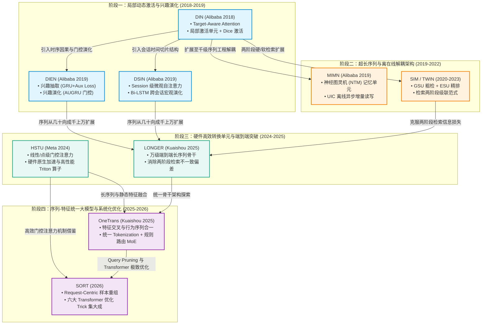

---

### 1.3 核心模型横向对比全景表（含论文直达链接）

| 模型 | 发表年份 / 会议 / 机构 | 论文链接 | 支持序列长度 $L$ | 核心序列建模机制 | 核心创新突破 / 解决痛点 |
| :--- | :--- | :--- | :--- | :--- | :--- |
| **DIN** | 2018 (KDD) <br> 阿里巴巴 | [arXiv:1706.06978](https://arxiv.org/abs/1706.06978) | $\sim 100$ | Target-Aware Attention | 首次提出局部激活单元；使同一用户根据不同候选商品展现出多峰兴趣偏好。 |
| **DIEN** | 2019 (AAAI) <br> 阿里巴巴 | [arXiv:1809.03672](https://arxiv.org/abs/1809.03672) | $\sim 100$ | GRU + 辅助损失 + AUGRU | 分离“兴趣抽取”与“兴趣演化”；辅助 Loss 强化序列隐状态对下游行为的预测力。 |
| **DSIN** | 2019 (IJCAI) <br> 阿里巴巴 | [arXiv:1905.06482](https://arxiv.org/abs/1905.06482) | 多个 Session | Session 自注意力 + Bi-LSTM | 洞察 30 分钟行为会话的同质性与跨会话漂移；将会话内部聚合与会话间时序结合。 |
| **MIMN** | 2019 (KDD) <br> 阿里巴巴 | [arXiv:1905.07207](https://arxiv.org/abs/1905.07207) | $\sim 1,000$ | NTM 神经图灵机内存读写 | 解决长序列在线预估延迟超标问题；通过 UIC 模块将用户兴趣更新与排序解耦。 |
| **HSTU** | 2024 (ICML) <br> Meta | [arXiv:2402.17152](https://arxiv.org/abs/2402.17152) | $\sim 8,192$ | 点级门控注意力 (非 Softmax) | 专为推荐定制的低复杂度序列生成式骨干；利用点积门控与高并行 Triton 算子实现极高 MFU。 |
| **LONGER**| 2025 (arXiv) <br> 快手 | [arXiv:2505.04421](https://arxiv.org/abs/2505.04421) | $\sim 10,000$ | 端到端长序列可扩展骨干 | 破解 SIM 等两阶段检索截断所引入的语义失真；在万级超长行为序列上实现端到端训练。 |
| **OneTrans**| 2025 (arXiv) <br> 快手 | [arXiv:2510.26104](https://arxiv.org/abs/2510.26104) | 统一混合输入 | 统一 Transformer + 规则 MoE | 终结“序列模块与特征交叉模块分离”的历史；统一 Tokenization 混合静态特征与序列。 |
| **SORT** | 2026 (arXiv) | [arXiv:2603.03988](https://arxiv.org/abs/2603.03988) | 长序列 + 多候选 | Request-Centric Transformer | 提出六大 Transformer 优化 Trick（Sink Token、Local Attention、Query Pruning 等），工业落地集大成。 |

---

## 二、 行为序列建模的核心矛盾与问题分类

### 2.1 局部激活与多兴趣表征（Target-Aware vs. Multi-Interest）
- **核心矛盾**：
  用户在电商或内容平台的兴趣具备极强的**多样性（Diversity）与多峰分布（Multi-Modal）**。例如一位年轻女性用户可能同时关注“数码外设”、“护肤美妆”与“孕婴童装”。
- **演进路线**：
  - 传统基线（如 Pooling）将历史全部加和压缩为单一固定向量，强行让不相关的商品（如在预测手机保护套时，历史购买的口红）稀释目标语义；
  - **DIN** 开创性提出 **Target-Aware Attention**，用当前候选 Target 作为 Query 去动态软加权历史，实现“不同候选、不同表征”；
  - **MIND / ComiRec** 进一步在召回端发展出基于胶囊网络（Capsule）的多兴趣提取机制。

### 2.2 会话微观时序 vs 终身宏观轨迹（Micro-Session vs. Life-Long History）
- **核心矛盾**：
  用户的历史行为不是平铺直叙的单一流，而是由具有明确时间截断的**微观会话（Session）**与长达数月的**终身宏观轨迹（Life-long History）**交织而成。
- **演进路线**：
  - **DSIN** 证明，用户在一个短时间窗口（如 30 分钟内）的多次交互具有极高的聚焦度与同质性（Session-Level Intent），而在跨天或跨周的跨度上，兴趣呈现宏观漂移；
  - 序列建模必须对微观 Session 内的密集互动与宏观跨 Session 的长周期演化进行分层解耦。

### 2.3 两阶段级联检索 vs 端到端原生缩放（Two-Stage Search vs. End-to-End Scaling）
- **核心矛盾**：
  用户的行为历史往往长达数万条。在标准自注意力 $O(L^2)$ 复杂度下，全量序列端到端计算会导致显存爆炸与推理延时超标。
- **演进路线**：
  - **两阶段检索方案（SIM, TWIN）**：先用快速检索（GSU，如类目硬筛选或向量索引软检索）从万级行为中捞取 Top-K（如 100~200 个相关项），再用精准注意力（ESU）计算权重。但缺点是第一阶段往往存在目标不一致（Consistency Bias），且硬筛选会丢掉跨品类弱关联；
  - **原生端到端架构（HSTU, LONGER）**：通过优化注意力算子结构（线性/局部/门控）与定制底层 GPU 核函数，直接在显存内全量喂入万级历史进行端到端联合反向传播。

### 2.4 静态特征交叉与动态序列的统一融合（Decoupled vs. Unified One-Transformer）
- **核心矛盾**：
  传统排序模型架构通常是“割裂拼盘式”的：左边挂一个 DLRM/DCN 负责静态特征交叉，右边挂一个 DIN/SIM 负责序列编码，最后粗暴地拼接送入顶层 MLP。
- **演进路线**：
  - 割裂设计使得静态特征（如 User 年龄、城市）无法在早期深入指导序列中的具体物品注意力，反之亦然；
  - **OneTrans 与 SORT** 开启了推荐统一大模型范式：将静态特征字段与动态行为物品序列统一 Token 化，送入同一个参数庞大的 Transformer Backbone 中完成全图注意力交互。

---

## 三、 核心序列模型深度拆解与数学推导

---

### 3.1 DIN：目标感知的局部注意力与自适应激活函数

- **论文标题**：[*Deep Interest Network for Click-Through Rate Prediction*](https://arxiv.org/abs/1706.06978)
- **发表出处**：ACM SIGKDD 2018
- **机构作者**：阿里巴巴（Guorui Zhou, Xiaoqiang Zhu, Chenru Song, Ying Fan 等）

#### 背景与核心动机
在 DIN 之前，工业界主流做法是将用户历史点击过的物品 Embedding 进行简单的 Sum-Pooling 或 Average-Pooling，生成一个固定维度的用户表征向量 $v_U$。这种做法抹杀了用户兴趣的多样性。DIN 提出了 **Local Activation Unit（局部激活单元）**，在给候选物品打分时，仅激活历史行为中与当前候选物品具有相关性的部分。

#### 核心网络结构与数学推导

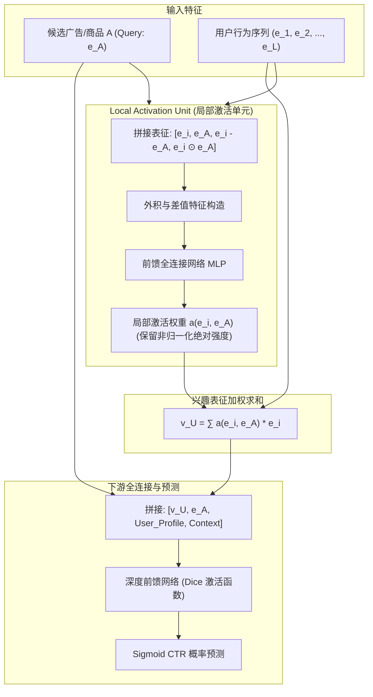

#### (1) 局部激活单元（Local Activation Unit）
设候选物品向量为 $e_A \in \mathbb{R}^d$，用户历史行为向量序列定义为：

$$
\mathcal{H} = \{e_1, e_2, \dots, e_L\}, \quad e_i \in \mathbb{R}^d
$$

每个历史行为 $e_i$ 与当前候选 $e_A$ 的相关性权重 $a(e_i, e_A)$ 通过一个小型前馈网络学习得到：

$$
a(e_i, e_A) = \mathrm{MLP}\big( [e_i, e_A, e_i - e_A, e_i \odot e_A] \big)
$$

其中不仅输入原始向量 $e_i$ 与 $e_A$，还显式构造了二者的差向量 $e_i - e_A$ 与逐元素外积项 $e_i \odot e_A$，为小型网络提供高阶交互的先验归纳偏置。

#### (2) 为什么摒弃 Softmax 归一化？
不同于传统自注意力机制，DIN **显式放弃了对权重 $a(e_i, e_A)$ 施加 Softmax 归一化**：

$$
v_U = \sum_{i=1}^L a(e_i, e_A) e_i
$$

- **理论依据**：Softmax 会强制所有权重的和为 1，这意味着若某用户历史上交互过 100 次且全部是强相关行为，其输出强度却会被“平均”；而一位仅有 1 次相关行为的低活用户，其单项权重也会因 Softmax 变为 1。
- 放弃 Softmax 使得加权求和向量 $v_U$ 的数值模长能够真实反映**用户对该特定品类的历史行为密集度与绝对偏好强度**。

#### (3) 数据自适应激活函数：Dice (Data Dependent Activation Function)
传统 PReLU 激活函数在 0 点处硬性折转，无法适应特征分布漂移。DIN 提出了自适应数据分布的 Dice 激活函数：

$$
f(s) = p(s) \cdot s + (1 - p(s)) \cdot \alpha s
$$

$$
p(s) = \frac{1}{1 + \exp\left( -\frac{s - \mathrm{E}[s]}{\sqrt{\mathrm{Var}[s] + \epsilon}} \right)}
$$

通过计算 Mini-batch 内样本的均值与方差，自适应根据数据分布平滑控制阶梯跃迁位置。

---

### 3.2 DIEN：兴趣抽取与候选引导的兴趣演化网络 (AUGRU)

- **论文标题**：[*Deep Interest Evolution Network for Click-Through Rate Prediction*](https://arxiv.org/abs/1809.03672)
- **发表出处**：AAAI 2019
- **机构作者**：阿里巴巴（Guorui Zhou, Na Mou, Ying Fan, Xiaoqiang Zhu 等）

#### 背景与动机
DIN 虽然实现了动态局部激活，但把历史行为序列看作一个“无序集合”，忽略了行为发生的前后时序因果性。用户的兴趣往往遵循一定的演化逻辑（例如：买手机壳的前提是买了新手机，买帐篷后会继续浏览防潮垫和露营灯）。DIEN 提出了兼顾**“潜在兴趣抽取”**与**“显式兴趣演化”**的两阶段循环网络。

#### 核心网络结构：两阶段 GRU 架构

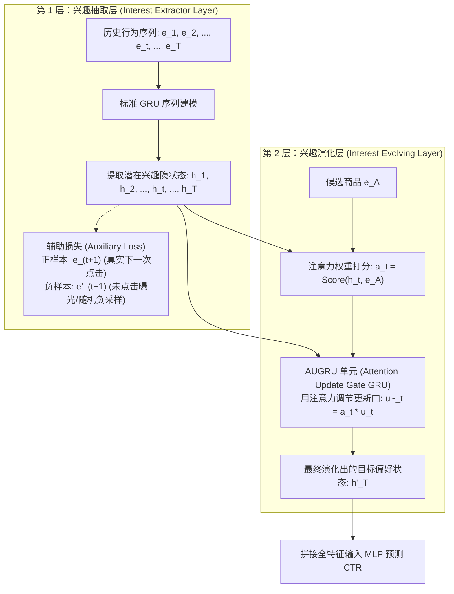

#### (1) 兴趣抽取层与辅助损失（Auxiliary Loss）
标准 GRU 仅依赖最终点击目标反传梯度，漫长的反向传播极难捕捉时序隐状态的微观跃迁。DIEN 创造性地引入了 **Auxiliary Loss（辅助损失）**：
强制要求时刻 $t$ 的隐藏状态 $h_t$ 必须能够准确预测第 $t+1$ 次真实发生的点击行为 $e_{t+1}$，同时区分负样本（未发生点击的曝光物品）$e'_{t+1}$：

$$
\mathcal{L}_{\mathrm{aux}} = -\frac{1}{N} \sum_{k=1}^N \sum_{t=1}^T \left[ \log \sigma(h_t^T e_{t+1}) + \log(1 - \sigma(h_t^T e'_{t+1})) \right]
$$

这一设计使得 GRU 的每一个隐藏状态 $h_t$ 均具备了确凿的“当前时刻综合兴趣表征”的物理含义。

#### (2) 兴趣演化层与 AUGRU (Attention Update Gate GRU)
为了让兴趣演化方向与最终打分的候选商品 $e_A$ 紧密绑定，DIEN 比较了三种注意力融入 GRU 的方案，最终确立了 **AUGRU**：
设标准 GRU 的更新门为 $u_t$（控制先前记忆保留与新候选信息的吸收比例）。AUGRU 直接将时刻 $t$ 对候选商品 $e_A$ 的注意力标量 $a_t$ 乘在更新门上：

$$
\tilde{u}_t = a_t \cdot u_t
$$

更新隐藏状态公式化为：

$$
h'_t = (1 - \tilde{u}_t) \odot h'_{t-1} + \tilde{u}_t \odot \tilde{h}'_t
$$

- **门控闭合（$a_t \to 0$）**：更新门 $\tilde{u}_t \to 0$，当前隐状态完全沿用前序状态 $h'_{t-1}$，直接跳过与候选无关的噪声交互；
- **门控导通（$a_t \to 1$）**：更新门 $\tilde{u}_t \to u_t$，网络全量更新隐状态，将该强相关兴趣推向演化主干。

---

### 3.3 DSIN：分会话兴趣分割与双向长程演化网络

- **论文标题**：[*Deep Session Interest Network for Click-Through Rate Prediction*](https://arxiv.org/abs/1905.06482)
- **发表出处**：IJCAI 2019
- **机构作者**：阿里巴巴（Yufei Feng, Fuzheng Zhang, Tingting Yao, Chenxu Wang 等）

#### 背景与核心洞察
用户在单次打开 App 时往往带有极强的聚焦目的（如寻找一件特定款式的冲锋衣），但下一次打开时意图可能完全改变。如果像 DIEN 那样将所有行为无差别的拼接为一个序列，会把不同 Session 之间的语义断裂强行平滑。
DSIN 提出了 **Session 概念**：**两次相邻行为如果时间间隔超过 30 分钟，则切割为一个独立的 Session**。

#### 核心网络结构：三阶段会话分层建模

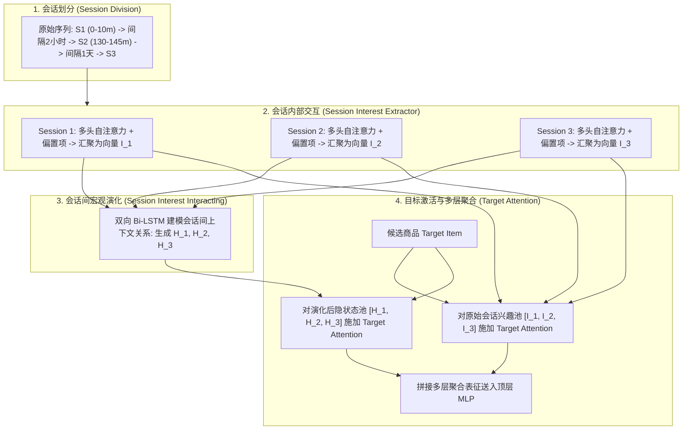

#### (1) 会话内部兴趣抽取（Session Interest Extractor）
设第 $k$ 个会话包含的行为序列为：

$$
S_k = [e_{k,1}, e_{k,2}, \dots, e_{k,T_k}]
$$

在会话内部，所有交互属于同质探索过程。DSIN 采用带有位置与类别偏置的多头自注意力机制提取纯净会话表征：

$$
I_k = \mathrm{AvgPool}\Big( \mathrm{MHSA}(S_k) \Big) \in \mathbb{R}^d
$$

#### (2) 会话间交互层（Session Interest Interacting Layer）
将所有会话的兴趣向量汇聚为跨会话序列：

$$
\mathcal{S}_{\mathrm{inter}} = [I_1, I_2, \dots, I_K]
$$

将其输入双向 LSTM（Bi-LSTM），同时捕捉历史会话的前向因果推进与后向全局修正：

$$
H_k = [\overrightarrow{h}_k ; \overleftarrow{h}_k] = \mathrm{BiLSTM}(I_k, H_{k-1}, H_{k+1})
$$

#### (3) 双重目标注意力激活（Dual Target Attention）
候选商品 $e_A$ 分别与原始会话兴趣 $I_k$ 及演化上下文 $H_k$ 计算注意力打分并加权汇聚，使得预测阶段既能看到用户在各个会话内最纯粹的静态偏好，又能看到全局时序演化的动态倾向。

---

### 3.4 MIMN：基于神经图灵机的高并发长序列 UIC 离线解耦架构

- **论文标题**：[*Practice on Long Sequential User Behavior Modeling for Click-Through Rate Prediction*](https://arxiv.org/abs/1905.07207)
- **发表出处**：ACM SIGKDD 2019
- **机构作者**：阿里巴巴（Qiwei Chen, Huan Zhao, Wei Li, Pipei Huang, Jian Xu）

#### 工程瓶颈：万级行为与线上毫秒级延迟的冲突
DIN 和 DIEN 仅能处理 100 左右长度的行为序列。当阿里巴巴尝试将序列长度扩展到 1,000 以上（覆盖数月行为）时，在线打分（Scoring）阶段面临严峻挑战：
1. **显存通信带宽饱和**：每个请求需要实时拉取用户长达数千维的历史向量；
2. **计算延时爆炸**：千级序列的动态 Attention 或 RNN 展开使得 P99 延时远超生产 SLA 限制（30ms）。

#### 突破性解耦架构：UIC (User Interest Center) 与 NTM 记忆单元

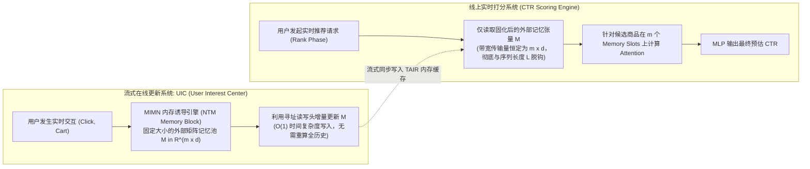

#### (1) 神经图灵机内存结构（Memory Inductive Mechanism）
MIMN 在内存中为每个用户维护一个固定插槽数量为 $m$（例如 $m=4 \sim 8$）、维度为 $d$ 的记忆矩阵：

$$
M_t \in \mathbb{R}^{m \times d}
$$

当新行为 $e_t$ 发生时，通过写寻址向量 $w_t^w \in \mathbb{R}^m$ 定位到该行为最强关联的内存通道，并执行可微擦除（Erase）与增加（Add）操作：

$$
M_t(k) = M_{t-1}(k) \odot \big( \mathbf{1} - w_t^w(k) e_t^{\mathrm{erase}} \big) + w_t^w(k) e_t^{\mathrm{add}}
$$

#### (2) 线上极速服务解耦（Serving Decoupling）
- **离线流式推进**：用户每次发生点击行为，仅触发一次 UIC 的增量 $O(1)$ 矩阵更新，写回用户特征库（如 Redis/TAIR）；
- **线上直接读取**：排序模型在线打分时，不再拉取千条原始行为，仅拉取已经凝练好的 $m \times d$ 记忆池矩阵进行局部注意力计算。无论用户历史序列有多长，线上 Serving 延迟完全恒定！

---

### 3.5 HSTU：千亿参数生成式推荐的原生高效序列转换单元

- **论文标题**：[*Actions Speak Louder than Words: Trillion-Parameter Sequential Transducers for Generative Recommendations*](https://arxiv.org/abs/2402.17152)
- **发表出处**：ICML 2024
- **机构作者**：Meta（Jiaqi Zhai, Lucy Liao, Xing Liu, Yueming Wang, Rui Li, Xuan Cao 等）

#### 背景与动机
2024 年，Meta 团队发表了在推荐领域引发巨大震动的文章 **HSTU**。
Meta 重新审视了语言模型的 Transformer 与推荐序列建模的本质区别：
标准 Transformer 依赖 Softmax 计算全局自注意力矩阵 $A = \mathrm{Softmax}(Q K^T / \sqrt{d})$。在超长序列（数千步）下：
1. **Softmax 是严重的 Memory-Bound 算子**，无法被 Tensor Core 高效 GEMM 硬件加速；
2. 推荐系统的行为序列缺乏自然语言严格的语法树结构，全量 Softmax 注意力存在严重的冗余计算与过平滑现象。

Meta 提出了全新的 **HSTU (Hierarchical Sequential Transduction Unit)**，用**硬件亲和的点级门控非线性注意力**彻底替代 Softmax，成为万亿参数大模型时代的主流骨干架构。

#### 核心网络结构与数学推导

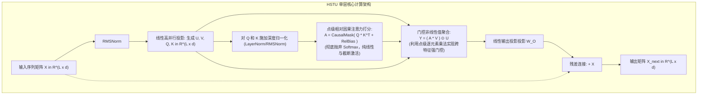

#### (1) 抛弃 Softmax 的点级门控注意力机制
给定序列长度 $L$ 的输入特征矩阵 $X \in \mathbb{R}^{L \times d}$，HSTU 首先通过一个高吞吐的全连接 GEMM 将其投影为四个分支张量：

$$
U, V, Q, K = \mathrm{Linear}(X)
$$

核心注意力图（Attention Map）直接通过归一化后的点积计算，并施加因果因果掩码（Causal Mask）与非线性截断激活：

$$
A = \mathrm{CausalMask}\left( \mathrm{Norm}(Q) \cdot \mathrm{Norm}(K)^T + \mathbf{R} \right)
$$

注意这里**没有任何 Softmax 归一化**！直接通过逐元素乘法完成门控值聚合：

$$
Y = \big( A \cdot V \big) \odot U
$$

$$
X_{\mathrm{out}} = \mathrm{Linear}(Y) + X
$$

其中 $U$ 扮演了强烈的门控筛选角色（Gating Signal），直接在通道维度调制聚合特征。

#### (2) 极致的软硬件协同优化（Co-Design）
- **MFU 提升**：传统 Transformer 在推荐上的 MFU 往往低于 15%，而 HSTU 的算子由连续的 GEMM 组成，配合定制开发的 **Flash-HSTU Triton Kernel**，直接将 GPU 计算利用率推至 50% 以上；
- **工业战果**：Meta 在 Instagram 和 Facebook 的推荐生产线中全量部署，在处理 **8,192 长度**的超长行为序列时，吞吐量相比传统 Transformer 提升了 **5 至 10 倍**，实现了推荐大模型（Trillion-Parameter Model）在线高 QPS 实时推理。

---

### 3.6 LONGER：工业级超长序列端到端可扩展骨干

- **论文标题**：[*LONGER: Scaling Up Long Sequence Modeling in Industrial Recommenders*](https://arxiv.org/abs/2505.04421)
- **发表出处**：arXiv 2025
- **机构作者**：快手技术团队（Kuaishou Technology）

#### 背景与痛点：两阶段级联架构的原罪
在快手短视频推荐中，用户每天产生数千次播放、点赞与关注，积累数月的行为量级轻松突破 10,000 条。此前工业界通行的 SIM / TWIN 等两阶段检索方案存在根本性缺陷：
- **阶段一（检索截断）**：第一阶段使用简单的向量检索或类别硬筛选过滤掉 99% 的数据，仅保留 100 条送入第二阶段；
- **误差累积（Consistency Bias）**：第一阶段漏掉的弱相关但高信息量的长尾交互，在后续精排中永远无法被召回，严重制约了模型能力的上限。

LONGER 的目标是：**在真实十亿级工业推荐场景中，彻底废黜两阶段级联检索，实现万级超长行为序列的全量端到端原生训练与推理**。

#### 核心技术突破

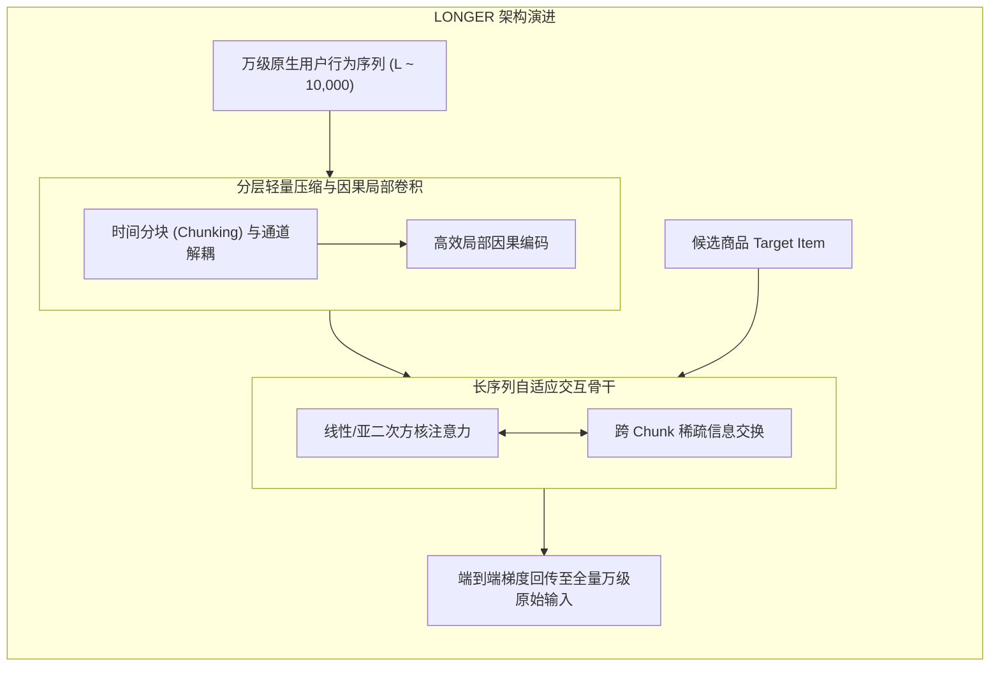

1. **层级化因果分块（Hierarchical Chunked Encoding）**：
   将万级序列按时间戳划分成固定大小的局部窗口（Chunks），窗口内通过快速硬件卷积提取密集时序意图，窗口间通过受控稀疏全局交互流动信息；
2. **端到端联合梯度流（Joint Gradient Propagation）**：
   从最终的多目标 CTR 损失直接反向传播至最早期的第一条历史行为 Embedding，彻底消除离线索引与在线打分之间的信息鸿沟；
3. 快手在线 A/B 测试表明，全量端到端建模比两阶段 SIM 带来了显著的停留时长（Watch Time）和用户活跃度增益。

---

### 3.7 OneTrans：静态特征与动态序列合流的统一大模型

- **论文标题**：[*OneTrans: Unified Feature Interaction and Sequence Modeling with One Transformer in Industrial Recommender*](https://arxiv.org/abs/2510.26104)
- **发表出处**：arXiv 2025
- **机构作者**：快手推荐算法团队（Kuaishou）

#### 范式革命：终结特征与序列割裂的历史
传统推荐精排模型长久以来呈现“拼盘形态”：
- 一侧是 DCNv2 / Wukong / RankMixer 等复杂的**非序列静态特征交叉模块**；
- 另一侧是 DIN / SIM / LONGER 等复杂的**用户行为序列提取模块**；
- 顶层通过简单的拼接输入 MLP。

快手团队在 **OneTrans (One Transformer)** 中指出：这种双轨制设计限制了特征之间的深度融合——用户的静态画像无法在底层指导行为序列的解耦，而序列中反映的即时偏好也无法作用于静态特征交叉。
OneTrans 提出了**用单一（One）Transformer 统一建模全部非序列特征与序列特征**的全新范式！

#### 统一架构设计与推导

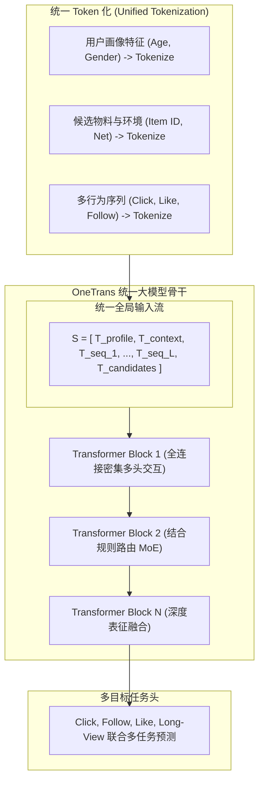

1. **统一输入表示（Unified Input Representation）**：
   - 静态字段通过独立的投影层映射为固定维度的特征 Token；
   - 动态行为序列的每个 Item 同样映射为同维度的序列 Token；
   - 将所有 Token 拼接为一个统一长序列输入 Transformer。
2. **规则路由与结构化稀疏（Rule-Guided Sparse MoE）**：
   在统一 Transformer 内部，不同类型的 Token（如序列 Token 与静态画像 Token）具备不同的语义计算特性。OneTrans 引入基于规则引导的专家路由机制，确保跨实体交叉既具备高自由度，又不会因同质化映射丢失领域特异性。

---

### 3.8 SORT：面向工业级排序的系统化优化 Transformer

- **论文标题**：[*SORT: A Systematically Optimized Ranking Transformer for Industrial-scale Recommenders*](https://arxiv.org/abs/2603.03988)
- **发表出处**：arXiv 2026
- **机构作者**：工业界前沿推荐架构联合研发团队

#### 核心定位与工业突破
2026 年最新发表的 **SORT (Systematically Optimized Ranking Transformer)** 是推荐精排大模型工程落地的集大成者。
作者指出，尽管 Transformer 在 LLM 中通过 Scaling 取得了无与伦比的成功，但在工业精排落地时一直遭遇**高吞吐、微秒级延迟与表格离散特征的三重围剿**。
SORT 创新性地提出了 **Request-Centric 样本重组**，并围绕标准 Transformer 架构精心设计了**六大关键优化 Trick**，在完全满足生产严苛延时要求的前提下，全面压制了现有工业级排序 SOTA 模型。

---

## 四、 重点专题：SORT 论文中六大 Transformer 优化 Trick 深度剖析

SORT 之所以能在工业精排中实现低延迟与高精度的极致平衡，核心在于其对 Transformer 结构从微观层面对症下药打出的“组合拳”。本章对这六大核心 Trick 进行深度技术剖析。

```
┌─────────────────────────────────────────────────────────────────────────────┐
│                    SORT 六大 Transformer 优化 Trick 全景布局                 │
├─────────────────────────────────────────────────────────────────────────────┤
│                                                                             │
│   [输入构建]  Trick 1: Special Token (BOS, SEP) ──► 边界识别 & Attention Sink│
│                                                                             │
│   [注意力层]  Trick 5: QK-Norm ─────────────────► 稳定深层注意力熵与数值稳定性│
│               Trick 2: Local Attention ─────────► 滑动窗口 O(L^2) -> O(W·L) │
│               Trick 4: Attention Gate ──────────► 点乘后门控调制过滤伪相关   │
│               Trick 3: Query Pruning ───────────► 逐层深度剪枝与时间衰减归纳 │
│                                                                             │
│   [前馈层群]  Trick 6: Sparse MoE ──────────────► 数据驱动动态路由容量超扩    │
│                                                                             │
└─────────────────────────────────────────────────────────────────────────────┘
```

---

### 4.1 Trick 1：Special Token 作为序列边界与 Attention Sink

#### 背景与原理
在标准语言模型中，特殊的标记（如 `[CLS]`, `<bos>`, `<eos>`）承载着控制序列生命周期的重任。而在排序模型中，通常直接将所有特征向量串联，导致模型缺乏序列语义区隔。
SORT 在输入序列构造中显式设计了两种特殊 Token：

$$
\mathbf{S} = [\texttt{BOS} ; \mathrm{Tokenize}(\mathcal{H}) ; \texttt{SEP} ; \mathrm{Tokenize}(\mathcal{U}) ; \texttt{SEP} ; \mathrm{Tokenize}(\mathcal{C})]
$$

其中：
- $\mathcal{H}$ 代表用户历史行为序列（User History）；
- $\mathcal{U}$ 代表用户静态画像（User Profile）；
- $\mathcal{C}$ 代表当前请求下的全体候选商品集合（Candidate Set）。

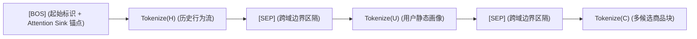

#### 两大核心功能与落地价值
1. **物理语义与位置边界（Explicit Boundary Indicator）**：
   表格推荐特征在拼装后极度冗长，`BOS` 与 `SEP` 提供了无可替代的硬性锚点，配合 RoPE 相对位置编码，使网络能够清晰判别哪些是过去的已发生行为，哪些是待打分的候选实体。
2. **作为“Attention Sink（注意力黑洞）”稳定 Softmax 分布**：
   这是该 Trick 最精妙的物理机制。在流式长文本与大语言模型研究中（如 StreamingLLM），学者发现第一位 Token 会吸收大量无意义但又必须被 Softmax 归一化消耗的多余注意力打分（Attention Sink 现象）。
   若没有设置专用的 `BOS` 标记，当候选商品与某些无意义的历史行为交互时，注意力权重会被迫在背景噪声物品之间乱飞，破坏候选预测的稳定性。`BOS` 承担了“吸收背景多余注意力分值”的职责，显著提高了下游核心特征打分的信噪比。

---

### 4.2 Trick 2：Local Attention（滑动窗口稀疏注意力）

#### 痛点与复杂度瓶颈
在用户长达数千步的交互中，标准的全局因果自注意力复杂度为 $O(L^2)$。当 $L=2,000$ 时，$L^2 = 4 \times 10^6$ 次内积计算，这在线上推理中是无法承受的。

#### 滑动窗口注意力拓扑
SORT 提出了一种非对称的**局部滑动窗口稀疏注意力掩码（Sparse Local Attention Mask）**：

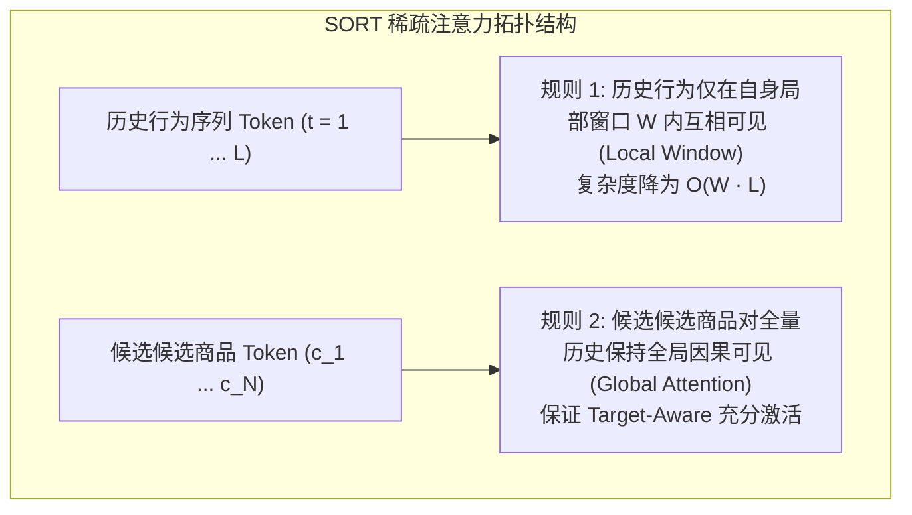

1. **历史 Token 间采用局部滑动窗口**：
   对于历史序列中的任意物品 $i_t$，它只能与以自身为中心、大小为 $W$ 的局部邻域窗口内的历史交互（$W \ll L$，例如 $W=64$）：

   $$
   \mathrm{Attention}(i_t, i_k) \neq 0 \iff t - W \le k \le t
   $$

   计算复杂度直接从 $O(L^2)$ 断崖式下降为 $O(W \cdot L)$。
2. **候选物品保持全局视界**：
   所有的候选物品 Token 仍被允许对**全量历史行为与画像**进行无死角的全局注意，确保在候选打分时不会丢失久远关键交互的信息。

---

### 4.3 Trick 3：Layer-wise Query Pruning（逐层查询剪枝与时间衰减偏置）

#### 架构机制：自底向上的序列逐层收敛
在传统的深层 Transformer（如 6～12 层）中，每一层输入的序列长度通常是恒定不变的。
SORT 借鉴并升级了 OneTrans 的思想，提出了**逐层查询剪枝机制（Layer-wise Query Pruning）**：
设第 $l-1$ 层的输入序列长度为 $L^{(l-1)}$，第 $l$ 层的序列长度严格单调递减：

$$
L^{(l)} \le L^{(l-1)}
$$

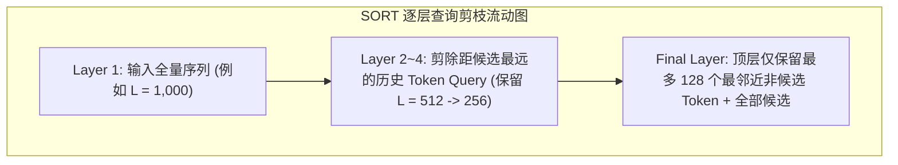

具体实现上，SORT 在底层利用抽取函数 $P(X, n)$ 仅提取与候选商品在时间上最邻近的后 $n$ 行向量作为当前层的 Query：

$$
Q_i = \mathrm{RMSNorm}\Big( P\big( X, L^{(l)} \big) W_i^Q \Big)
$$

$$
K_i = \mathrm{RMSNorm}\big( X W_i^K \big), \quad V_i = X W_i^V
$$

#### 为什么剪枝不仅不掉点，反而大幅涨点？
1. **大幅减半算力消耗**：高层网络的注意力矩阵尺寸从 $L \times L$ 缩减为 $L^{(l)} \times L^{(0)}$，整个深层 Transformer 的综合 FLOPs 直接减半；
2. **契合时间衰减的强先验（Temporal Decay Inductive Bias）**：
   推荐系统与自然语言完全不同。距离当前请求越远的用户行为，其微观意图参考价值越微弱。自底向上逐步收敛注意力焦点，强迫网络在高层聚焦于近期核心行为，本质上为模型注入了极佳的时间衰减归纳偏置。

---

### 4.4 Trick 4：Attention Gate（注意力门控机制与动态去噪）

#### 痛点剖析
受限于表格特征的离散性与噪声，自注意力机制计算出的 Softmax 打分矩阵常常出现**“伪相关激活”**（即某些由于特征共现造成的虚假高注意力权重）。即使经过点积缩放，这些噪声依然会强行混入 Value 向量聚合中。

#### 门控注意力数学实现
SORT 借鉴了 HSTU 与 Gated Attention 的前沿设计，在计算出标准点积注意力汇聚后，额外引入一个并行的**门控矩阵 $G_i$**：

$$
G_i = \sigma\left( P\big( X, L^{(l)} \big) W_i^G \right)
$$

单个注意力头的最终输出表达为门控与注意力汇聚结果的逐元素哈达玛积：

$$
\mathrm{Head}_i = G_i \odot \left( \mathrm{Softmax}\left( \frac{\mathcal{R}(Q_i, K_i) + M}{\sqrt{d_k}} \right) V_i \right)
$$

其中：
- $\mathcal{R}(\cdot)$ 代表注入的 RoPE 相对位置编码变换；
- $M$ 为稀疏注意力因果掩码；
- $\sigma$ 为 Sigmoid 非线性激活。

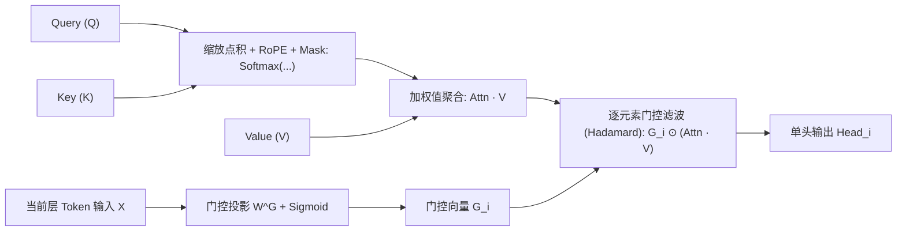

- **核心价值**：通过门控向量 $G_i$ 可以在通道级别自主决定当前聚合特征的“通断”。当某候选商品未在某注意力头中找到真正高置信的相关历史时，门控可以主动逼近 0，彻底过滤掉聚合噪声，赋予网络极强的抑噪鲁棒性。

---

### 4.5 Trick 5：QK-Norm（Query-Key 均方根归一化稳定熵衰减）

#### 背景与深层训练不稳定性
在将 Transformer 加深（如 8 层以上）或者使用长序列时，工程师经常遭遇**注意力熵坍缩（Attention Entropy Collapse）**：
点积 $Q K^T$ 的内积数值随着网络深度加深而逐渐剧烈发散，导致送入 Softmax 的 logits 极大，Softmax 函数输出迅速饱和退化为极端的 One-Hot 分布，梯度几乎归零，引发深层梯度消失。

#### QK-Norm 公式化实施
SORT 在计算 Query 与 Key 投影后、进行矩阵相乘之前，对 $Q_i$ 与 $K_i$ 分别施加无中心偏移的 **RMSNorm**：

$$
Q_i = \mathrm{RMSNorm}\left( P\big(X, L^{(l)}\big) W_i^Q \right)
$$

$$
K_i = \mathrm{RMSNorm}\left( X W_i^K \right)
$$

其中 $\mathrm{RMSNorm}(z)$ 定义为：

$$
\mathrm{RMSNorm}(z) = \frac{z}{\sqrt{\frac{1}{d_k} \sum_{j=1}^{d_k} z_j^2 + \epsilon}} \odot \gamma
$$

- **核心价值**：
  将每个 Token 的 Query 和 Key 向量严格约束在固定半径的高维超球面上。点积 $Q K^T$ 事实上退化为余弦相似度（Cosine Similarity），从数学根本上封死了 Logits 发散的通道，使深层多头注意力训练变得极度平稳，彻底消除了深度扩展时的梯度断崖。

---

### 4.6 Trick 6：Sparse MoE（数据驱动动态路由与容量扩展）

#### 背景与架构升级
在前馈网络（FFN）部分，传统网络使用单一的稠密前馈层（如 SwishGLU）。虽然加宽 FFN 能有效提升模型容量，但计算量与延迟随参数量呈线性恶化。

#### 数据驱动动态 Top-k 路由
不同于 OneTrans 采用人工规则（根据 Token 类别强行指定专家），SORT 采用了完全**由数据驱动的 Sparse MoE 架构**：

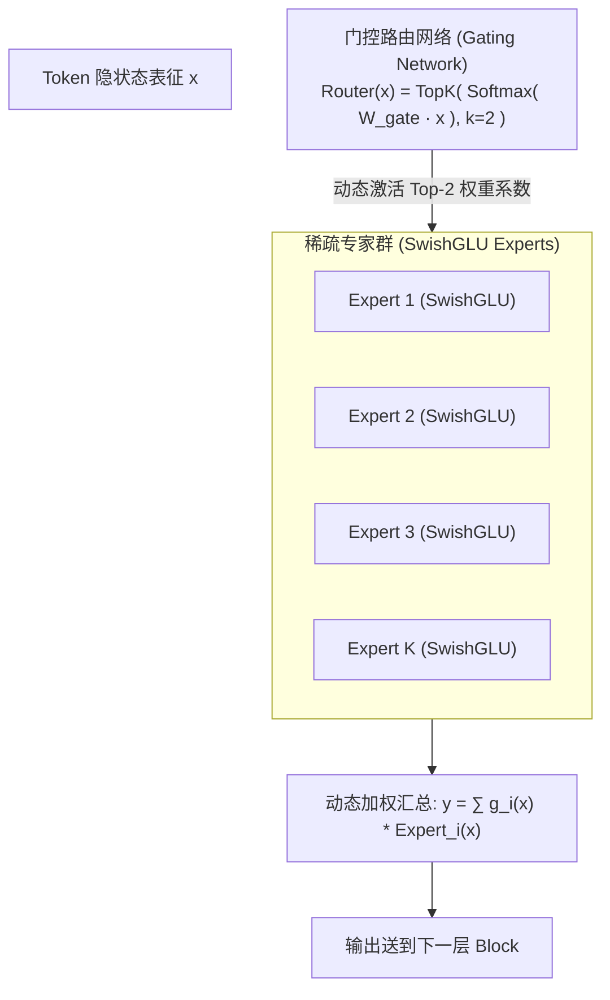

1. **动态分发**：对于每个 Token，门控网络实时计算其在 $E$ 个专家库上的亲和概率分布，仅激活得分最高的前 $k$ 个专家（如 $k=2$）：

   $$
   g(x) = \mathrm{TopK}\Big( \mathrm{Softmax}(W_{\mathrm{gate}} x), \; k \Big)
   $$

2. **加权汇聚**：

   $$
   y = \sum_{i \in \mathrm{TopK}} g_i(x) \cdot \mathrm{Expert}_i(x)
   $$

3. **容量解耦红利**：在保持每次推理激活计算量不变的前提下，模型静态参数量被放大数倍，使得网络具备足够广阔的子空间去记忆多样化的用户与商品组合分布。

---

## 五、 延伸建议：值得关注的序列建模关键基准补充

如果你希望进一步完善推荐序列专题的技术谱系，以下五大工作在工业界各发展节点同样起到了里程碑级的作用，极具参考价值：

### 5.1 工业超长序列双检索基准：SIM 与 TWIN
- **SIM (Search-based Interest Model, Alibaba, CIKM 2020)**：
  - [arXiv:2006.05639](https://arxiv.org/abs/2006.05639)
  - 奠定了工业界处理 $L \ge 10^4$ 终身序列的两阶段检索基线（GSU 粗检 + ESU 细查），通过类目硬匹配（Hard Search）以极低成本筛选相关子集。
- **TWIN (Two-stage Interest Network, Kuaishou, ACM SIGKDD 2023)**：
  - [arXiv:2302.02352](https://arxiv.org/abs/2302.02352)
  - 揭示了 SIM 两阶段检索中 GSU 与 ESU 目标不一致的系统偏差，提出**双塔一致性约束**，让第一阶段高效检索的同时保持与第二阶段精准打分的强一致性。

### 5.2 极致哈希与端到端采样检索：ETA 与 SDIM
- **ETA (End-to-End Target Attention, Alibaba, 2021)**：
  - [arXiv:2108.04468](https://arxiv.org/abs/2108.04468)
  - 首次将 **SimHash（局部敏感哈希）** 引入长序列建模。利用 Hamming 距离快速筛选 Top-K，使得长序列注意力检索可以端到端计算梯度反传。
- **SDIM (Sampling-based Deep Interest Model, Meituan, ACM CIKM 2022)**：
  - [arXiv:2205.10249](https://arxiv.org/abs/2205.10249)
  - 美团提出基于多重随机哈希采样的无损近似，彻底告别了传统两阶段检索，单次哈希碰撞直接等价于全序列 Softmax 期望聚合，算力消耗极低。

### 5.3 原生 Transformer 序列奠基：BST 与 SASRec
- **BST (Behavior Sequence Transformer, Alibaba, 2019)**：
  - [arXiv:1905.06874](https://arxiv.org/abs/1905.06874)
  - 业内首次直接将标准 Transformer Encoder 应用于用户短序列建模，奠定了自注意力替代传统 RNN/CNN 的历史地位。
- **SASRec (Self-Attentive Sequential Recommendation, IEEE ICDM 2018)**：
  - [arXiv:1808.09781](https://arxiv.org/abs/1808.09781)
  - 序列推荐召回领域的开山巨作，单向因果自注意力建模下一项点击的经典范式。

### 5.4 静态交叉与长序列统一标杆：WHALE
- **WHALE (Wukong-HSTU Architecture for Large-scale Recommendation, 2026)**：
  - [arXiv:2607.19059](https://arxiv.org/abs/2607.19059)
  - 融合 **Wukong**（高阶非序列特征交叉大模型）与 **HSTU**（超长序列生成式骨干），设计了双流渐进交互桥接机制，代表了工业界万亿模型同时处理“高阶表格交叉 + 超长行为序列”的终极技术探索。

---

## 六、 工业落地总结与演进决策指南

基于上述技术脉络的系统梳理，我们总结出以下四条实战选型与落地决策建议：

1. **短序列（$L \le 100$）场景的务实选择**：
   对于大多数中小规模业务，**DIN** 及其升级版依然是最具性价比的 baseline；若时序先后依赖性极强且有足够算力，可升级至带有辅助损失的 **DIEN**。
2. **超长序列（$L \ge 1,000$）的工程妥协与演进**：
   - 若系统受限于严格延迟（P99 < 20ms）且集群以 CPU 为主，应优先考虑 **SIM / TWIN 两阶段架构** 或 **MIMN 离线异步读写**；
   - 若集群已全面完成现代 GPU 迁移，且追求极致的端到端天花板效果，应坚决拥抱 **HSTU** 或 **LONGER** 这类非 Softmax、硬件亲和的原生端到端骨干。
3. **精排 Transformer 的六大必选补丁（借鉴 SORT）**：
   如果团队正在将标准 Transformer 引入精排阶段，**切忌直接裸跑原生结构**：
   - 务必加入 **QK-Norm** 防止深层梯度消失；
   - 务必设置 **Special Token (BOS/SEP)** 充当 Attention Sink 锚点；
   - 针对超长历史，必须采用 **Local Attention** 与 **逐层 Query 剪枝** 卸除算力包袱。
4. **大模型时代“统一架构（Unified Backbone）”是长期终局**：
   从过去的“特征工程拼盘”走向以 **OneTrans / SORT / WHALE** 为代表的“统一 Tokenization + 单一庞大稀疏 Transformer 骨干”，是未来三年工业界沉淀核心技术红利的明确方向。
